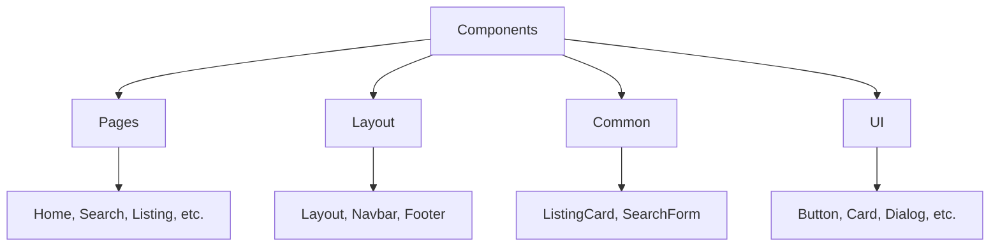
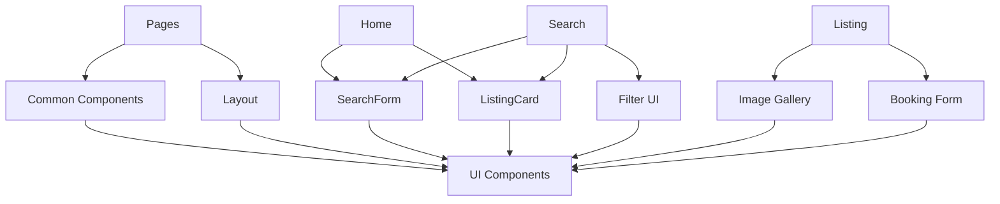

<div align="center">

# 🧩 Components

**Complete component library documentation for StayFinder**

[← Documentation Home](./README.md) • [Hooks →](./hooks.md)

</div>

---

## 📚 Component Overview

StayFinder uses a **three-tier component architecture**:

1. **Pages** - Top-level route components
2. **Common Components** - Reusable business logic components
3. **UI Components** - Low-level shadcn/ui primitives

---

## 🎯 Component Categories



---

## 📄 Page Components

Page components are top-level route components that represent full pages.

### Home

**Location:** `src/pages/Home.tsx`

Main landing page featuring:
- Hero section with search form
- Trending destinations
- Featured stays
- Benefits section

**Features:**
- Displays trending destinations from listings
- Shows top-rated featured stays
- Includes hero search form

### Search

**Location:** `src/pages/Search.tsx`

Search results page with filtering and sorting:
- Search form
- Filter sidebar (price, type, rating, amenities)
- Sort options
- Pagination
- Results grid

**Props:** None (reads from URL query params)

**State Management:**
- Uses `useSearchParams` for URL state
- Local state for filters
- `useMemo` for filtered results

### Listing

**Location:** `src/pages/Listing.tsx`

Detailed listing view with:
- Image gallery with lightbox
- Booking form
- Reviews section
- Amenities list
- Host information
- Area highlights

**Route:** `/listing/:id`

**Features:**
- Image carousel
- Date picker for booking
- Guest selector
- Price calculation
- Wishlist toggle
- Booking creation

### Trips

**Location:** `src/pages/Trips.tsx`

User's trip management page:
- Upcoming trips
- Past trips
- Trip cancellation
- Trip details

**Uses:** `useBookings` hook

### Wishlist

**Location:** `src/pages/Wishlist.tsx`

Saved listings page:
- Grid of wishlisted items
- Remove from wishlist
- Empty state

**Uses:** `useWishlist` hook

---

## 🏗️ Layout Components

### Layout

**Location:** `src/components/layout/Layout.tsx`

Main layout wrapper component.

**Props:**

```typescript
interface LayoutProps {
  children: React.ReactNode;
}
```

**Usage:**

```typescript
<Layout>
  <YourPageContent />
</Layout>
```

**Features:**
- Wraps pages with Navbar and Footer
- Provides consistent page structure
- Handles responsive layout

### Navbar

**Location:** `src/components/layout/Navbar.tsx`

Navigation bar component.

**Features:**
- Responsive design (mobile menu)
- Active route highlighting
- Logo and branding
- Navigation links: Home, Trips, Wishlist

**State:**
- `isOpen` - Mobile menu toggle

### Footer

**Location:** `src/components/layout/Footer.tsx`

Footer component with:
- Links
- Copyright information
- Social links (if applicable)

---

## 🎨 Common Components

### ListingCard

**Location:** `src/components/common/ListingCard.tsx`

Card component for displaying listing previews.

**Props:**

```typescript
interface ListingCardProps {
  listing: Listing;
}
```

**Features:**
- Image carousel with navigation
- Wishlist toggle button
- Rating display
- Price per night
- Location information
- Instant book badge
- Hover effects

**Usage:**

```typescript
<ListingCard listing={listing} />
```

**Interactive Elements:**
- Image navigation (prev/next)
- Wishlist toggle
- Click to navigate to details

### SearchForm

**Location:** `src/components/common/SearchForm.tsx`

Search form component with location, dates, and guests.

**Props:**

```typescript
interface SearchFormProps {
  variant?: 'hero' | 'compact';
  initialValues?: {
    location?: string;
    checkIn?: string;
    checkOut?: string;
    guests?: number;
  };
}
```

**Variants:**
- `hero` - Large hero-style form (home page)
- `compact` - Compact inline form (search page)

**Features:**
- Location autocomplete
- Date pickers (check-in/check-out)
- Guest counter
- Form validation
- URL navigation on submit

**Usage:**

```typescript
// Hero variant
<SearchForm variant="hero" />

// Compact variant with initial values
<SearchForm 
  variant="compact"
  initialValues={{
    location: "Paris",
    checkIn: "2024-01-15",
    checkOut: "2024-01-20",
    guests: 2
  }}
/>
```

---

## 🎨 UI Components (shadcn/ui)

StayFinder uses **shadcn/ui** components built on Radix UI primitives. These are low-level, accessible components.

### Component List

| Component | Location | Purpose |
|-----------|----------|---------|
| **Accordion** | `accordion.tsx` | Collapsible content sections |
| **Alert** | `alert.tsx` | Alert messages |
| **Alert Dialog** | `alert-dialog.tsx` | Modal confirmation dialogs |
| **Avatar** | `avatar.tsx` | User profile images |
| **Badge** | `badge.tsx` | Status labels and tags |
| **Button** | `button.tsx` | Interactive buttons |
| **Card** | `card.tsx` | Content containers |
| **Checkbox** | `checkbox.tsx` | Checkbox inputs |
| **Dialog** | `dialog.tsx` | Modal dialogs |
| **Dropdown Menu** | `dropdown-menu.tsx` | Context menus |
| **Form** | `form.tsx` | Form wrapper with validation |
| **Input** | `input.tsx` | Text inputs |
| **Label** | `label.tsx` | Form labels |
| **Select** | `select.tsx` | Dropdown selects |
| **Separator** | `separator.tsx` | Visual dividers |
| **Sheet** | `sheet.tsx` | Slide-out panels |
| **Skeleton** | `skeleton.tsx` | Loading placeholders |
| **Slider** | `slider.tsx` | Range inputs |
| **Switch** | `switch.tsx` | Toggle switches |
| **Tabs** | `tabs.tsx` | Tabbed interfaces |
| **Toast** | `toast.tsx` | Notification toasts |
| **Tooltip** | `tooltip.tsx` | Hover tooltips |

### Most Used Components

#### Button

**Usage:**

```typescript
import { Button } from '@/components/ui/button';

<Button variant="default">Click me</Button>
<Button variant="outline">Outline</Button>
<Button variant="ghost">Ghost</Button>
<Button variant="destructive">Delete</Button>
```

**Variants:** `default`, `outline`, `ghost`, `destructive`, `link`

#### Card

**Usage:**

```typescript
import { Card, CardHeader, CardTitle, CardContent } from '@/components/ui/card';

<Card>
  <CardHeader>
    <CardTitle>Title</CardTitle>
  </CardHeader>
  <CardContent>
    Content here
  </CardContent>
</Card>
```

#### Dialog

**Usage:**

```typescript
import { Dialog, DialogContent, DialogHeader, DialogTitle } from '@/components/ui/dialog';

<Dialog open={isOpen} onOpenChange={setIsOpen}>
  <DialogContent>
    <DialogHeader>
      <DialogTitle>Dialog Title</DialogTitle>
    </DialogHeader>
    Content here
  </DialogContent>
</Dialog>
```

#### Input

**Usage:**

```typescript
import { Input } from '@/components/ui/input';

<Input type="text" placeholder="Enter text" />
<Input type="email" />
<Input type="number" />
```

#### Select

**Usage:**

```typescript
import { Select, SelectContent, SelectItem, SelectTrigger, SelectValue } from '@/components/ui/select';

<Select>
  <SelectTrigger>
    <SelectValue placeholder="Select option" />
  </SelectTrigger>
  <SelectContent>
    <SelectItem value="option1">Option 1</SelectItem>
    <SelectItem value="option2">Option 2</SelectItem>
  </SelectContent>
</Select>
```

#### Toast

**Usage:**

```typescript
import { toast } from '@/components/ui/use-toast';

toast({
  title: "Success",
  description: "Operation completed",
});
```

---

## 🔗 Component Relationships



---

## 📝 Component Patterns

### Composition Pattern

Components are built using composition:

```typescript
// Large component composed of smaller ones
<Layout>
  <Navbar />
  <PageContent>
    <SearchForm />
    <ListingCard />
  </PageContent>
  <Footer />
</Layout>
```

### Props Pattern

Consistent props interface:

```typescript
interface ComponentProps {
  // Required props
  required: string;
  // Optional props with defaults
  optional?: number;
  // Children
  children?: React.ReactNode;
}
```

### Variant Pattern

Using `class-variance-authority`:

```typescript
const buttonVariants = cva(
  "base-classes",
  {
    variants: {
      variant: {
        default: "default-classes",
        outline: "outline-classes",
      },
    },
  }
);
```

---

## 🎨 Styling Components

### Tailwind CSS

All components use Tailwind utility classes:

```typescript
<div className="flex items-center gap-2 p-4 bg-background rounded-lg">
  Content
</div>
```

### Theme Variables

Components use CSS variables for theming:

```css
--background: theme color
--foreground: text color
--primary: primary color
--secondary: secondary color
```

### Responsive Design

Mobile-first approach:

```typescript
<div className="grid grid-cols-1 md:grid-cols-2 lg:grid-cols-3">
  {/* Responsive grid */}
</div>
```

---

## ♿ Accessibility

All shadcn/ui components are built on **Radix UI**, which provides:

- ✅ **Keyboard Navigation** - Full keyboard support
- ✅ **ARIA Attributes** - Proper ARIA labels
- ✅ **Focus Management** - Proper focus handling
- ✅ **Screen Reader Support** - Accessible to assistive technologies

---

## 🚀 Performance

### Optimization Techniques

| Technique | Implementation |
|----------|---------------|
| **Memoization** | `React.memo()` for expensive components |
| **Lazy Loading** | Route-based code splitting |
| **Image Optimization** | Lazy loading, proper sizing |
| **Code Splitting** | Dynamic imports for pages |

### Best Practices

1. **Keep components small** - Single responsibility
2. **Use composition** - Build complex from simple
3. **Memoize expensive renders** - Use `useMemo`, `useCallback`
4. **Lazy load routes** - Reduce initial bundle size

---

## 📖 Component Examples

### Creating a New Component

```typescript
// src/components/common/MyComponent.tsx
import { Card, CardContent } from '@/components/ui/card';
import type { MyComponentProps } from '@/types';

export function MyComponent({ title, content }: MyComponentProps) {
  return (
    <Card>
      <CardContent>
        <h3>{title}</h3>
        <p>{content}</p>
      </CardContent>
    </Card>
  );
}
```

### Using Components Together

```typescript
import { Layout } from '@/components/layout/Layout';
import { SearchForm } from '@/components/common/SearchForm';
import { ListingCard } from '@/components/common/ListingCard';
import { Button } from '@/components/ui/button';

export function MyPage() {
  return (
    <Layout>
      <SearchForm variant="compact" />
      <div className="grid grid-cols-3 gap-4">
        {listings.map(listing => (
          <ListingCard key={listing.id} listing={listing} />
        ))}
      </div>
      <Button>Load More</Button>
    </Layout>
  );
}
```

---

<div align="center">

**Next:** Learn about [Custom Hooks](./hooks.md) →

</div>

