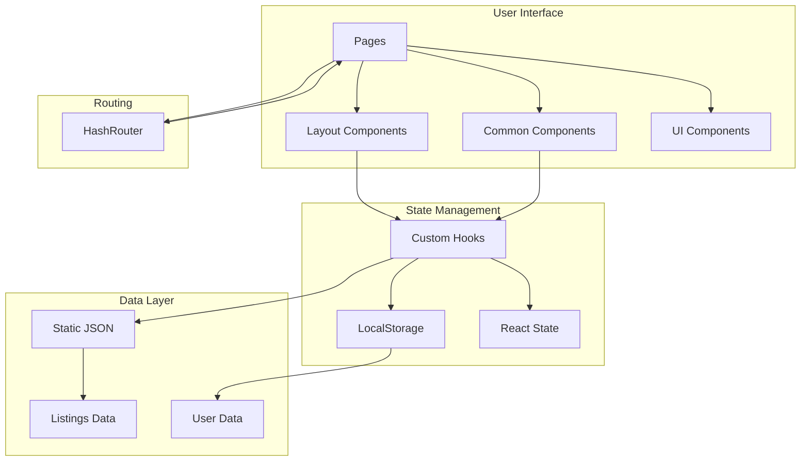

<div align="center">

# 📚 StayFinder Documentation

**Complete guide to understanding, developing, and deploying StayFinder**

[← Back to Main README](../README.md)

</div>

---

## 🗺️ Documentation Overview

Welcome to the StayFinder documentation! This comprehensive guide covers everything you need to know about the project, from getting started to advanced deployment strategies.

### 📑 Table of Contents

**English:**
| Document | Description |
|----------|-------------|
| [🚀 Getting Started](./getting-started.md) | Quick start guide, installation, and first steps |
| [🏗️ Architecture](./architecture.md) | Project structure, design patterns, and system architecture |
| [🧩 Components](./components.md) | Complete component library documentation |
| [🎣 Hooks](./hooks.md) | Custom React hooks API and usage |
| [📊 API & Data](./api-data.md) | Data structures, types, and data flow |
| [🚢 Deployment](./deployment.md) | Deployment guide for GitHub Pages |

**Русский:**
| Документ | Описание |
|----------|-------------|
| [🚀 Быстрый старт](../ru/getting-started.md) | Руководство по быстрому старту, установке и первым шагам |
| [🏗️ Архитектура](../ru/architecture.md) | Структура проекта, паттерны проектирования и архитектура системы |
| [🧩 Компоненты](../ru/components.md) | Полная документация библиотеки компонентов |
| [🎣 Hooks](../ru/hooks.md) | API и использование кастомных React hooks |
| [📊 API и данные](../ru/api-data.md) | Структуры данных, типы и потоки данных |
| [🚢 Развертывание](../ru/deployment.md) | Руководство по развертыванию на GitHub Pages |

---

## 🎯 Project Overview

StayFinder is a modern booking UI demonstration application that showcases:

- **Frontend-only architecture** - No backend required, uses localStorage for persistence
- **Component-based design** - Built with React and shadcn/ui components
- **Type-safe development** - Full TypeScript coverage
- **Modern tooling** - Vite for fast development and optimized builds
- **PWA capabilities** - Installable as a Progressive Web App

### 🏗️ High-Level Architecture



---

## 📂 Project Structure

```
stay-finder-delight/
├── 📁 public/              # Static assets
│   ├── favicon.svg        # App icon (location pin)
│   ├── site.webmanifest   # PWA manifest
│   └── robots.txt         # SEO configuration
│
├── 📁 src/
│   ├── 📁 components/      # React components
│   │   ├── 📁 common/      # Shared business components
│   │   │   ├── ListingCard.tsx
│   │   │   └── SearchForm.tsx
│   │   ├── 📁 layout/      # Layout components
│   │   │   ├── Layout.tsx
│   │   │   ├── Navbar.tsx
│   │   │   └── Footer.tsx
│   │   ├── NavLink.tsx     # Custom navigation link
│   │   └── 📁 ui/          # shadcn/ui components (50+ components)
│   │
│   ├── 📁 data/            # Static data
│   │   └── listings.json   # Accommodation listings
│   │
│   ├── 📁 hooks/           # Custom React hooks
│   │   ├── useWishlist.ts
│   │   ├── useBookings.ts
│   │   ├── useLocalStorage.ts
│   │   └── use-mobile.tsx
│   │
│   ├── 📁 lib/             # Utilities and helpers
│   │   ├── constants.ts    # App constants
│   │   ├── formatters.ts   # Formatting utilities
│   │   ├── dateUtils.ts    # Date helpers
│   │   ├── queryParams.ts  # URL query handling
│   │   ├── storage.ts      # Storage helpers
│   │   └── utils.ts        # General utilities
│   │
│   ├── 📁 pages/           # Page components
│   │   ├── Home.tsx
│   │   ├── Search.tsx
│   │   ├── Listing.tsx
│   │   ├── Trips.tsx
│   │   └── Wishlist.tsx
│   │
│   └── 📁 types/           # TypeScript definitions
│       └── index.ts
│
├── 📁 docs/                # Documentation (you are here!)
│
├── 📁 .github/
│   └── 📁 workflows/
│       └── deploy-pages.yml # GitHub Actions workflow
│
└── Configuration files
    ├── vite.config.ts      # Vite configuration
    ├── tailwind.config.ts  # Tailwind CSS config
    └── tsconfig.json       # TypeScript config
```

---

## 🔑 Key Concepts

### Component Architecture

StayFinder follows a **component-based architecture** with clear separation of concerns:

- **Pages** - Top-level route components
- **Layout Components** - Structure and navigation
- **Common Components** - Reusable business logic components
- **UI Components** - Low-level shadcn/ui primitives

### State Management

The app uses a **hybrid state management approach**:

- **Local State** - React `useState` for component-specific state
- **LocalStorage** - Custom hooks for persistent data (wishlist, bookings)
- **URL State** - Query parameters for search filters

### Routing Strategy

Uses **HashRouter** instead of BrowserRouter to:

- Avoid 404 errors on GitHub Pages
- Work with static hosting
- Enable deep linking without server configuration

---

## 🛠️ Technology Stack

<div align="center">

| Layer          | Technology            | Purpose                    |
| -------------- | --------------------- | -------------------------- |
| **Framework**  | React 18.3            | UI library                 |
| **Language**   | TypeScript 5.8        | Type safety                |
| **Build Tool** | Vite 5.4              | Fast dev server & bundling |
| **UI Library** | shadcn/ui             | Component primitives       |
| **Styling**    | Tailwind CSS 3.4      | Utility-first CSS          |
| **Routing**    | React Router 6.30     | Client-side routing        |
| **Icons**      | Lucide React          | Icon library               |
| **Forms**      | React Hook Form + Zod | Form handling & validation |
| **Date Utils** | date-fns 3.6          | Date manipulation          |

</div>

---

## 📖 Quick Links

### For Developers

- 🚀 [Getting Started Guide](./getting-started.md) - Set up your development environment
- 🏗️ [Architecture Deep Dive](./architecture.md) - Understand the system design
- 🧩 [Component Reference](./components.md) - Browse available components
- 🎣 [Hooks API](./hooks.md) - Learn about custom hooks

### For Deployment

- 🚢 [Deployment Guide](./deployment.md) - Deploy to GitHub Pages
- 📊 [Data Structures](./api-data.md) - Understand data formats

---

## 💡 Best Practices

When working with StayFinder, keep these practices in mind:

1. **Type Safety First** - Always use TypeScript types
2. **Component Reusability** - Prefer composition over duplication
3. **Performance** - Use React.memo and useMemo where appropriate
4. **Accessibility** - Follow ARIA guidelines (shadcn/ui handles this)
5. **Code Organization** - Keep related files together

---

## 🤝 Contributing

While this is a demo project, contributions are welcome! When contributing:

1. Follow the existing code style
2. Add TypeScript types for new features
3. Update documentation as needed
4. Test your changes thoroughly

---

## 📞 Support

For questions or issues:

1. Check the relevant documentation section
2. Review the [Architecture Guide](./architecture.md) for system design
3. Examine the [Component Documentation](./components.md) for usage examples

---

<div align="center">

**Ready to dive in?** Start with the [Getting Started Guide](./getting-started.md) →

</div>
