<div align="center">

# 🏗️ Architecture

**System design, structure, and architectural patterns of StayFinder**

[← Documentation Home](./README.md) • [Components →](./components.md)

</div>

---

## 📐 System Overview

StayFinder follows a **component-based, frontend-only architecture** with clear separation of concerns. The application is built using React with TypeScript, leveraging modern patterns and best practices.

### Core Principles

- 🧩 **Component Composition** - Small, reusable components
- 📦 **Separation of Concerns** - Clear boundaries between layers
- 🔒 **Type Safety** - Full TypeScript coverage
- ⚡ **Performance** - Optimized rendering and lazy loading
- 💾 **Local Persistence** - localStorage for user data

---

## 🗂️ Project Structure

```
stay-finder-delight/
│
├── 📁 public/                    # Static assets
│   ├── favicon.svg              # App icon
│   ├── site.webmanifest        # PWA manifest
│   └── robots.txt               # SEO config
│
├── 📁 src/
│   ├── 📁 components/           # React components
│   │   ├── 📁 common/           # Business components
│   │   │   ├── ListingCard.tsx  # Listing display card
│   │   │   └── SearchForm.tsx   # Search form component
│   │   │
│   │   ├── 📁 layout/           # Layout components
│   │   │   ├── Layout.tsx       # Main layout wrapper
│   │   │   ├── Navbar.tsx       # Navigation bar
│   │   │   └── Footer.tsx       # Footer component
│   │   │
│   │   ├── NavLink.tsx          # Custom navigation link
│   │   │
│   │   └── 📁 ui/               # shadcn/ui primitives (50+)
│   │       ├── button.tsx
│   │       ├── card.tsx
│   │       └── ...              # More UI components
│   │
│   ├── 📁 data/                 # Static data
│   │   └── listings.json        # Accommodation listings
│   │
│   ├── 📁 hooks/                # Custom React hooks
│   │   ├── useWishlist.ts       # Wishlist management
│   │   ├── useBookings.ts       # Booking management
│   │   ├── useLocalStorage.ts   # localStorage wrapper
│   │   └── use-mobile.tsx       # Mobile detection hook
│   │
│   ├── 📁 lib/                  # Utilities & helpers
│   │   ├── constants.ts         # App constants
│   │   ├── formatters.ts        # Formatting functions
│   │   ├── dateUtils.ts         # Date utilities
│   │   ├── queryParams.ts       # URL query handling
│   │   └── storage.ts           # Storage helpers
│   │
│   ├── 📁 pages/                # Page components
│   │   ├── Home.tsx             # Home page
│   │   ├── Search.tsx           # Search results
│   │   ├── Listing.tsx          # Listing details
│   │   ├── Trips.tsx            # User trips
│   │   └── Wishlist.tsx         # User wishlist
│   │
│   ├── 📁 types/                # TypeScript definitions
│   │   └── index.ts             # All type definitions
│   │
│   ├── App.tsx                  # Main app component
│   ├── main.tsx                 # Entry point
│   └── index.css                # Global styles
│
├── 📁 docs/                     # Documentation
├── 📁 .github/workflows/        # CI/CD
│   └── deploy-pages.yml         # GitHub Actions
│
└── Configuration files
    ├── vite.config.ts          # Vite config
    ├── tailwind.config.ts      # Tailwind config
    └── tsconfig.json            # TypeScript config
```

---

## 🏛️ Architecture Layers

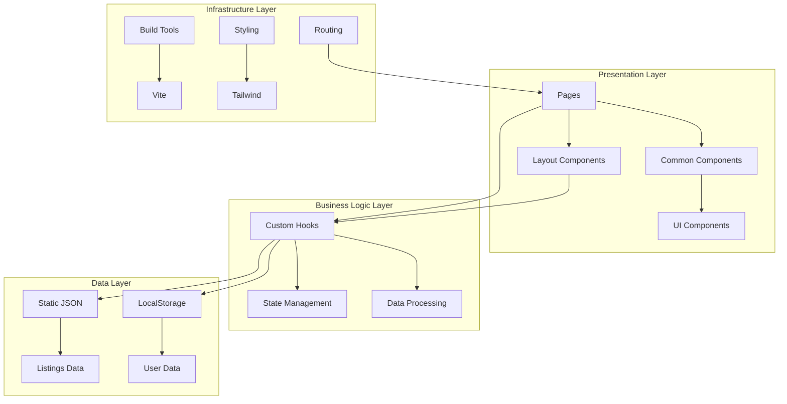

---

## 🔄 Data Flow

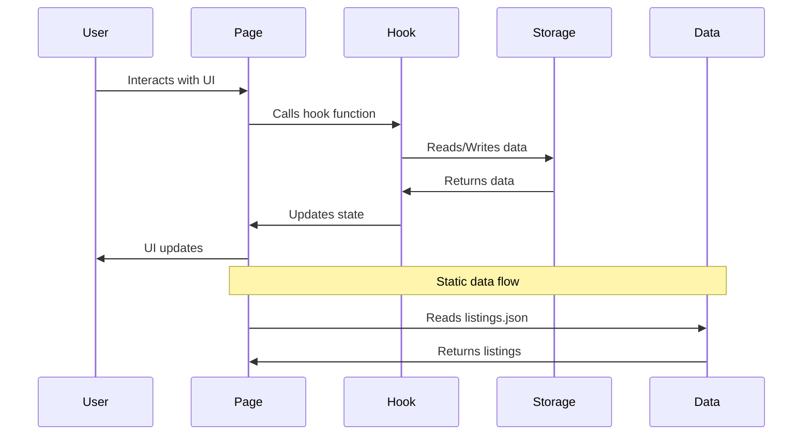

---

## 🧩 Component Architecture

### Component Hierarchy

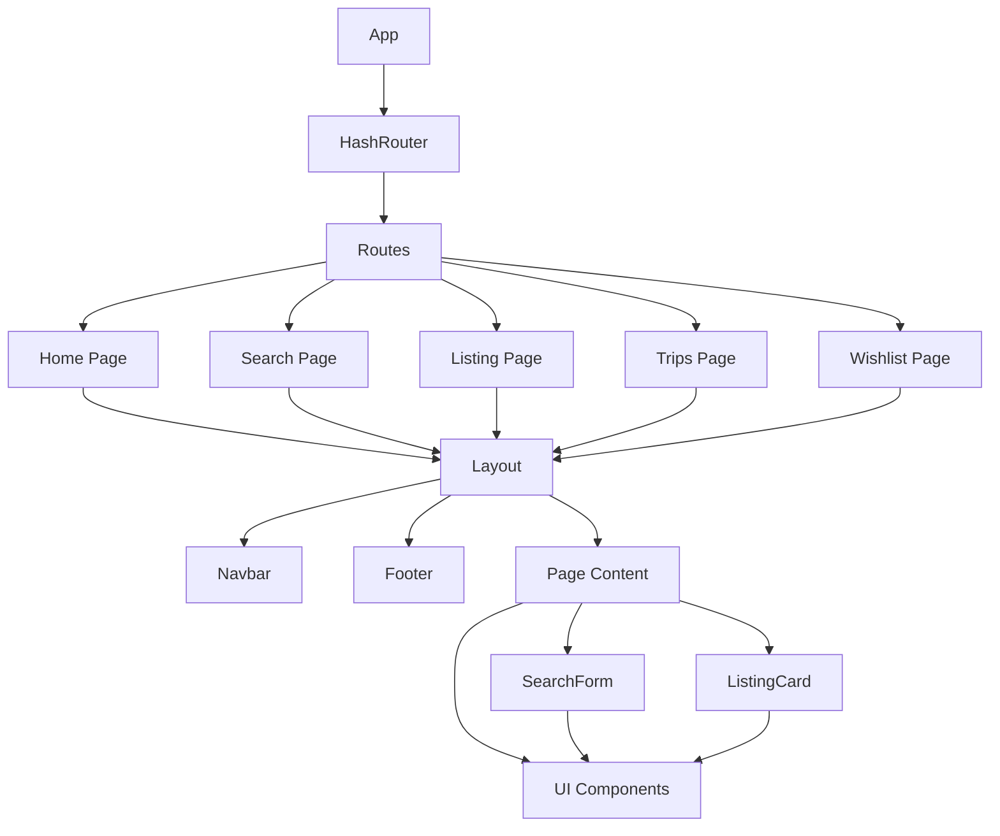

### Component Categories

| Category   | Purpose                      | Examples                            |
| ---------- | ---------------------------- | ----------------------------------- |
| **Pages**  | Top-level route components   | `Home.tsx`, `Search.tsx`            |
| **Layout** | Structure and navigation     | `Layout.tsx`, `Navbar.tsx`          |
| **Common** | Reusable business components | `ListingCard.tsx`, `SearchForm.tsx` |
| **UI**     | Low-level primitives         | `Button`, `Card`, `Dialog`          |

---

## 🔀 Routing Architecture

StayFinder uses **HashRouter** for client-side routing:

```mermaid
graph LR
    A[HashRouter] --> B[Routes]
    B --> C[/ - Home]
    B --> D[/#/search - Search]
    B --> E[/#/listing/:id - Details]
    B --> F[/#/trips - Trips]
    B --> G[/#/wishlist - Wishlist]
    B --> H[* - 404]

    style C fill:#e1f5ff
    style D fill:#e1f5ff
    style E fill:#e1f5ff
    style F fill:#e1f5ff
    style G fill:#e1f5ff
    style H fill:#ffe1e1
```

### Why HashRouter?

- ✅ Works with static hosting (GitHub Pages)
- ✅ No server configuration needed
- ✅ Avoids 404 errors on refresh
- ✅ Deep linking works out of the box

---

## 💾 State Management

### State Architecture

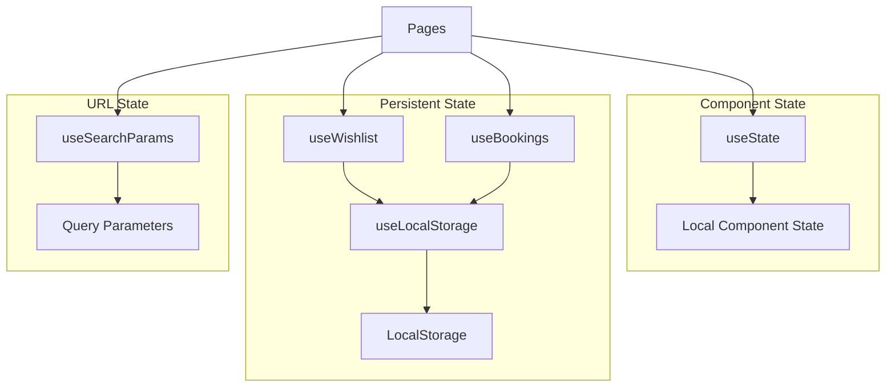

### State Management Strategy

| State Type           | Solution          | Use Case                     |
| -------------------- | ----------------- | ---------------------------- |
| **Component State**  | `useState`        | UI state, form inputs        |
| **Persistent State** | `useLocalStorage` | Wishlist, bookings           |
| **URL State**        | `useSearchParams` | Search filters, pagination   |
| **Derived State**    | `useMemo`         | Filtered lists, calculations |

---

## 🎣 Hooks Architecture

### Custom Hooks Flow

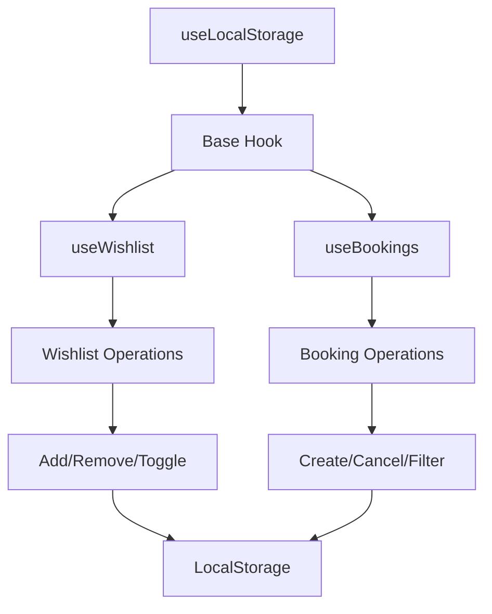

### Hook Dependencies

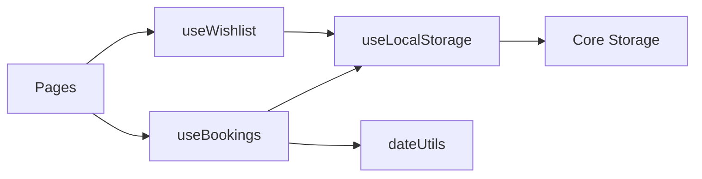

---

## 📊 Data Flow Patterns

### Search Flow

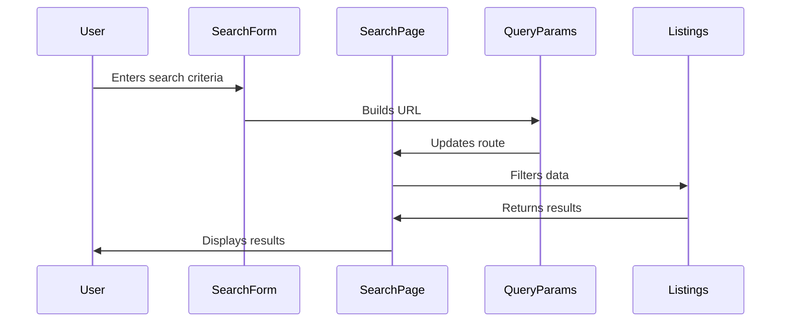

### Booking Flow

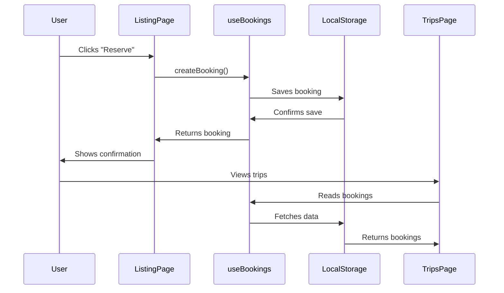

---

## 🎨 Styling Architecture

### Tailwind CSS Structure

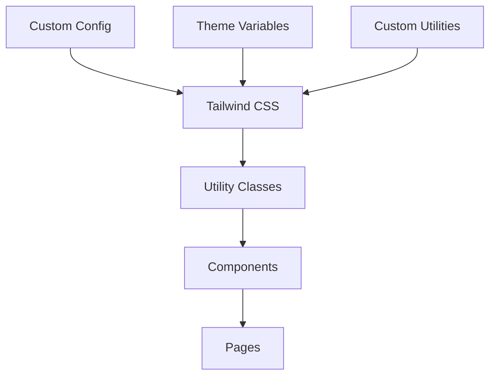

### Styling Approach

- **Utility-First** - Tailwind utility classes
- **Component Variants** - Using `class-variance-authority`
- **Theme System** - CSS variables for theming
- **Responsive Design** - Mobile-first approach

---

## ⚡ Performance Optimizations

### Code Splitting

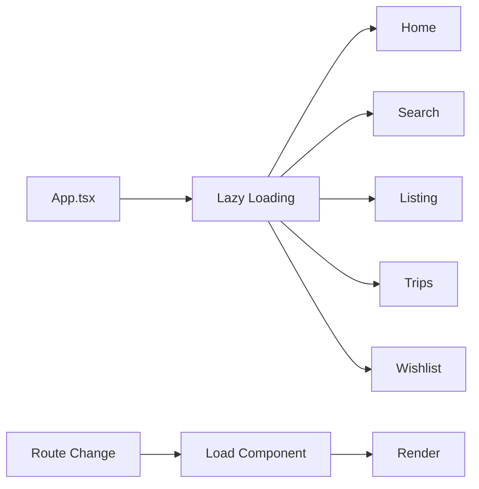

### Optimization Strategies

| Technique              | Implementation           | Benefit                |
| ---------------------- | ------------------------ | ---------------------- |
| **Lazy Loading**       | `React.lazy()`           | Smaller initial bundle |
| **Code Splitting**     | Route-based              | Load on demand         |
| **Memoization**        | `useMemo`, `useCallback` | Prevent re-renders     |
| **Image Optimization** | Lazy loading             | Faster page load       |

---

## 🔐 Type Safety

### TypeScript Architecture

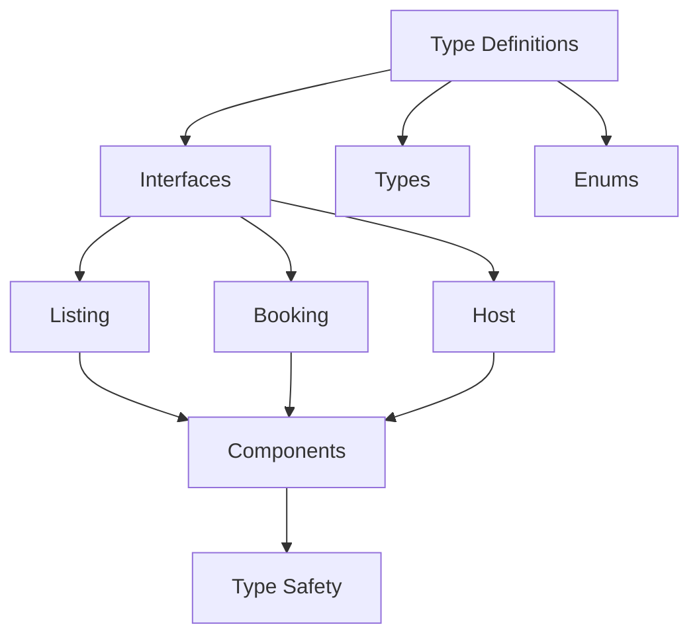

### Type Coverage

- ✅ **100% Type Coverage** - All files are typed
- ✅ **Strict Mode** - TypeScript strict enabled
- ✅ **Type Inference** - Leverages TypeScript inference
- ✅ **Generic Types** - Reusable type patterns

---

## 🚀 Build & Deployment

### Build Process

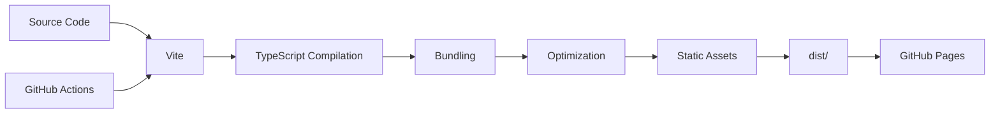

### Deployment Flow

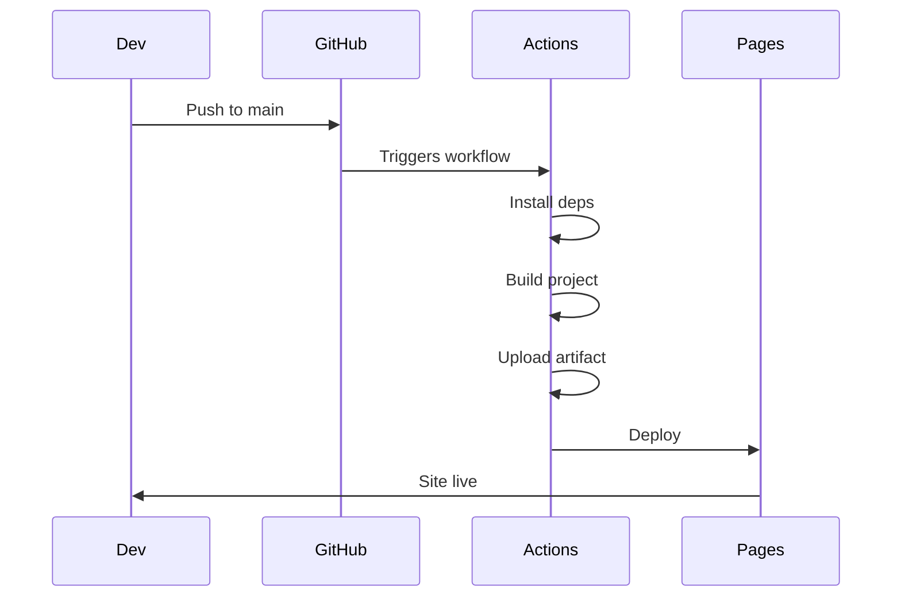

---

## 📦 Dependency Management

### Core Dependencies

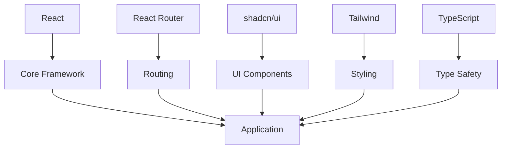

---

## 🎯 Design Patterns

### Patterns Used

| Pattern                     | Implementation            | Purpose           |
| --------------------------- | ------------------------- | ----------------- |
| **Component Composition**   | Small, focused components | Reusability       |
| **Custom Hooks**            | Business logic extraction | Code organization |
| **Higher-Order Components** | Layout wrapper            | Code reuse        |
| **Render Props**            | Flexible component API    | Flexibility       |
| **Controlled Components**   | Form inputs               | Predictable state |

---

## 🔄 Lifecycle & Updates

### Component Lifecycle

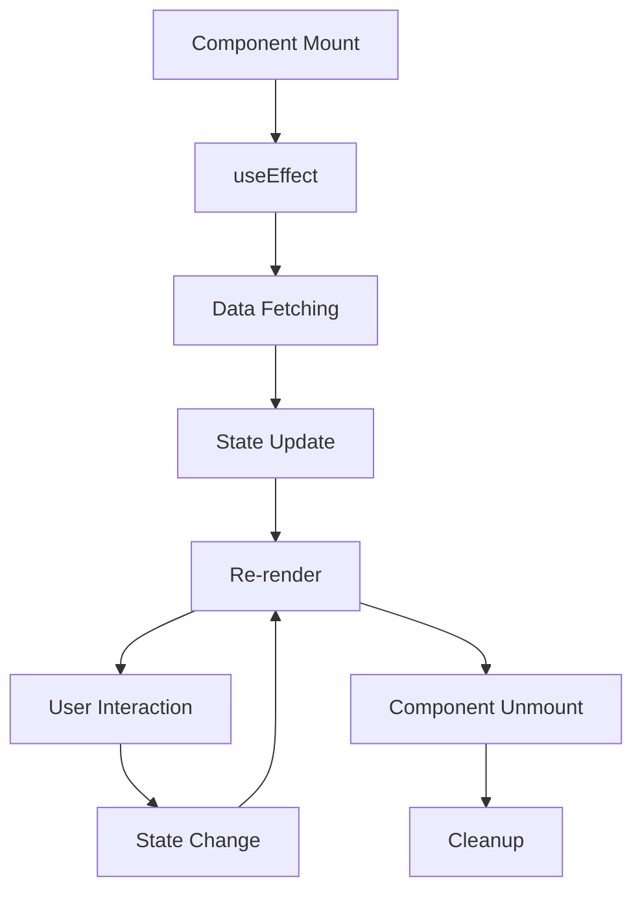

---

<div align="center">

**Next:** Learn about [Components](./components.md) →

</div>
