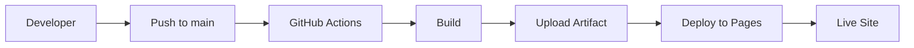
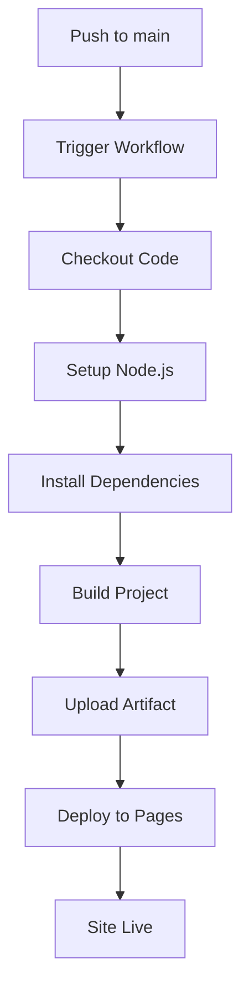
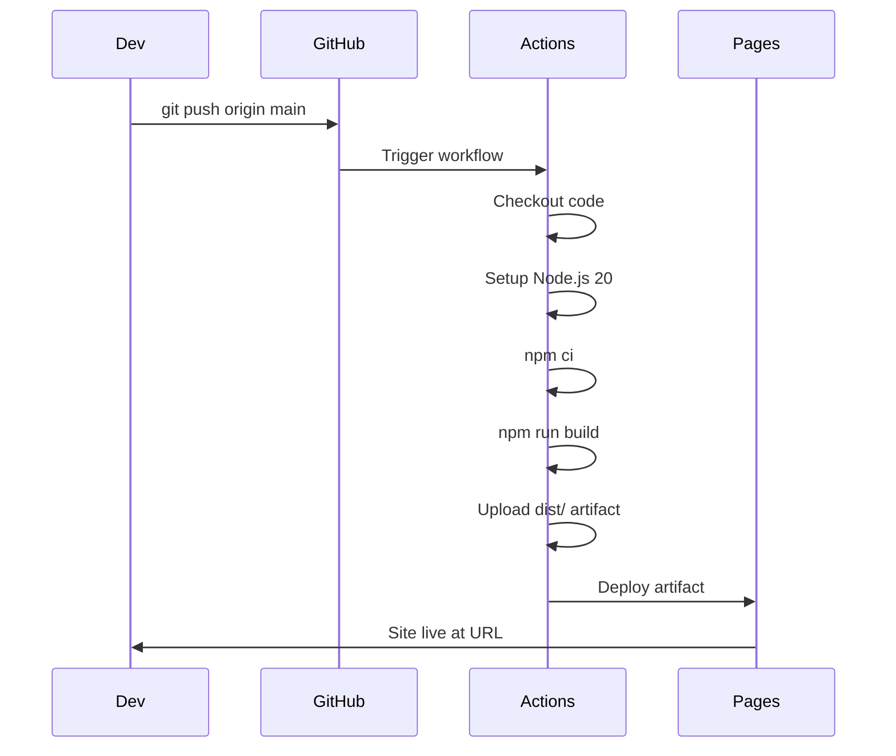

<div align="center">

# 🚢 Deployment Guide

**Complete guide to deploying StayFinder to GitHub Pages**

[← Documentation Home](./README.md)

</div>

---

## 📋 Overview

StayFinder is configured for **automatic deployment** to GitHub Pages using GitHub Actions. Every push to the `main` branch triggers a build and deployment workflow.

### Deployment Architecture



---

## ⚙️ Prerequisites

Before deploying, ensure:

- ✅ Repository is on GitHub
- ✅ You have push access to the repository
- ✅ GitHub Pages is enabled (we'll configure this)

---

## 🚀 Quick Start Deployment

### Step 1: Push to GitHub

```bash
# If not already on GitHub
git remote add origin https://github.com/YOUR_USERNAME/stay-finder-delight.git
git push -u origin main
```

### Step 2: Enable GitHub Pages

1. Go to your repository on GitHub
2. Navigate to **Settings** → **Pages**
3. Under **Source**, select **GitHub Actions**
4. Save the settings

### Step 3: Trigger Deployment

The deployment workflow runs automatically on:

- ✅ Push to `main` branch
- ✅ Manual trigger via **Actions** tab → **Run workflow**

### Step 4: Wait for Deployment

1. Go to **Actions** tab
2. Watch the "Deploy to GitHub Pages" workflow
3. Wait for it to complete (usually 2-3 minutes)

### Step 5: Access Your Site

Your site will be available at:

```
https://<USERNAME>.github.io/<REPO_NAME>/
```

For example:

```
https://johndoe.github.io/stay-finder-delight/
```

---

## 🔧 GitHub Actions Workflow

### Workflow File

Location: `.github/workflows/deploy-pages.yml`

### Workflow Structure



### Workflow Steps

#### 1. Build Job

```yaml
jobs:
  build:
    runs-on: ubuntu-latest
    steps:
      - Checkout code
      - Setup Node.js 20
      - Install dependencies (npm ci)
      - Build project (npm run build)
      - Setup Pages
      - Upload artifact (dist/)
```

#### 2. Deploy Job

```yaml
deploy:
  runs-on: ubuntu-latest
  needs: build
  environment: github-pages
  steps:
    - Deploy to GitHub Pages
```

### Complete Workflow

```yaml
name: Deploy to GitHub Pages

on:
  push:
    branches: ["main"]
  workflow_dispatch:

permissions:
  contents: read
  pages: write
  id-token: write

concurrency:
  group: "pages"
  cancel-in-progress: true

jobs:
  build:
    runs-on: ubuntu-latest
    steps:
      - name: Checkout
        uses: actions/checkout@v4

      - name: Setup Node
        uses: actions/setup-node@v4
        with:
          node-version: "20"
          cache: "npm"

      - name: Install
        run: npm ci

      - name: Build
        run: npm run build

      - name: Setup Pages
        uses: actions/configure-pages@v5

      - name: Upload artifact
        uses: actions/upload-pages-artifact@v3
        with:
          path: dist

  deploy:
    runs-on: ubuntu-latest
    needs: build
    environment:
      name: github-pages
      url: ${{ steps.deployment.outputs.page_url }}
    steps:
      - name: Deploy
        id: deployment
        uses: actions/deploy-pages@v4
```

---

## ⚙️ Configuration

### Vite Configuration

The project is configured for GitHub Pages with:

```typescript
// vite.config.ts
export default defineConfig({
  base: "./", // Important for GitHub Pages
  // ...
});
```

**Why `base: "./"`?**

- GitHub Pages serves from `/<REPO_NAME>/`
- Relative paths ensure assets load correctly
- Works with HashRouter routing

### HashRouter

StayFinder uses **HashRouter** instead of BrowserRouter:

```typescript
// src/App.tsx
import { HashRouter } from 'react-router-dom';

<HashRouter>
  <Routes>
    {/* Routes */}
  </Routes>
</HashRouter>
```

**Why HashRouter?**

- Works with static hosting (GitHub Pages)
- No server configuration needed
- Avoids 404 errors on refresh
- Deep linking works automatically

---

## 📦 Build Output

### Build Process

```bash
npm run build
```

**Output:** `dist/` directory containing:

- `index.html` - Main HTML file
- `assets/` - JavaScript, CSS, images
- `favicon.svg` - App icon
- `site.webmanifest` - PWA manifest

### Build Artifacts

The workflow uploads the entire `dist/` directory to GitHub Pages.

---

## 🔍 Deployment Process

### Detailed Flow



### Timeline

| Step       | Duration     | Description          |
| ---------- | ------------ | -------------------- |
| Checkout   | ~10s         | Clone repository     |
| Setup Node | ~5s          | Install Node.js      |
| Install    | ~30-60s      | Install dependencies |
| Build      | ~30-60s      | Build project        |
| Upload     | ~10s         | Upload artifact      |
| Deploy     | ~30s         | Deploy to Pages      |
| **Total**  | **~2-3 min** | Complete deployment  |

---

## 🐛 Troubleshooting

### Build Fails

**Problem:** Build step fails

**Solutions:**

1. Check Actions logs for errors
2. Verify `package.json` dependencies
3. Ensure Node.js version is 20+
4. Check for TypeScript errors: `npm run build` locally

### Deployment Fails

**Problem:** Deploy step fails

**Solutions:**

1. Verify GitHub Pages is enabled
2. Check repository permissions
3. Ensure workflow has `pages: write` permission
4. Check if another deployment is in progress

### Assets Not Loading

**Problem:** Images/CSS/JS not loading

**Solutions:**

1. Verify `base: "./"` in `vite.config.ts`
2. Check asset paths are relative
3. Clear browser cache
4. Check browser console for 404 errors

### 404 on Refresh

**Problem:** Getting 404 when refreshing pages

**Solutions:**

1. Ensure HashRouter is used (not BrowserRouter)
2. Verify routes use hash (`/#/search` not `/search`)
3. Check that all routes are defined

### Site Not Updating

**Problem:** Changes not appearing after deployment

**Solutions:**

1. Wait a few minutes (CDN cache)
2. Hard refresh browser (Ctrl+Shift+R)
3. Check Actions tab for successful deployment
4. Verify you pushed to `main` branch

---

## 🔄 Manual Deployment

### Trigger Manually

1. Go to **Actions** tab
2. Select **Deploy to GitHub Pages** workflow
3. Click **Run workflow**
4. Select branch (usually `main`)
5. Click **Run workflow**

### Deploy from Local

```bash
# Build locally
npm run build

# The dist/ folder is ready
# But GitHub Actions handles deployment automatically
```

---

## 🌐 Custom Domain

### Setting Up Custom Domain

1. Go to repository **Settings** → **Pages**
2. Under **Custom domain**, enter your domain
3. Add CNAME file to repository (GitHub may do this automatically)
4. Configure DNS records:
   - **Type:** CNAME
   - **Name:** `@` or `www`
   - **Value:** `<USERNAME>.github.io`

### DNS Configuration

```
Type: CNAME
Name: www
Value: johndoe.github.io
```

---

## 📊 Deployment Status

### Check Deployment Status

1. **Actions Tab** - See workflow runs
2. **Settings → Pages** - See deployment history
3. **Site URL** - Visit to verify it's live

### Deployment History

GitHub Pages keeps a deployment history:

- Each deployment is logged
- Can view previous deployments
- Can rollback if needed

---

## 🔐 Permissions

### Required Permissions

The workflow needs:

```yaml
permissions:
  contents: read # Read repository
  pages: write # Deploy to Pages
  id-token: write # OIDC authentication
```

### Repository Settings

Ensure:

- ✅ GitHub Pages is enabled
- ✅ Source is set to "GitHub Actions"
- ✅ Repository is public (or you have GitHub Pro)

---

## 🎯 Best Practices

### 1. Test Before Deploying

```bash
# Build locally first
npm run build

# Preview build
npm run preview

# Test locally
npm run dev
```

### 2. Use Semantic Versioning

Tag releases for better tracking:

```bash
git tag v1.0.0
git push origin v1.0.0
```

### 3. Monitor Deployments

- Check Actions tab regularly
- Monitor deployment times
- Watch for build errors

### 4. Keep Dependencies Updated

```bash
npm outdated
npm update
```

### 5. Environment Variables

If needed, add secrets in:
**Settings** → **Secrets and variables** → **Actions**

---

## 📝 Deployment Checklist

Before deploying:

- [ ] Code is tested locally
- [ ] `npm run build` succeeds
- [ ] All dependencies are committed
- [ ] `package-lock.json` is up to date
- [ ] GitHub Pages is enabled
- [ ] Workflow file is in `.github/workflows/`
- [ ] `base: "./"` is set in `vite.config.ts`
- [ ] HashRouter is used (not BrowserRouter)

---

## 🚀 Post-Deployment

### Verify Deployment

1. Visit your site URL
2. Test all routes:
   - Home page
   - Search page
   - Listing details
   - Trips page
   - Wishlist page
3. Check browser console for errors
4. Test on mobile devices

### Monitor Performance

- Check page load times
- Monitor bundle sizes
- Test on different browsers
- Verify PWA functionality

---

## 🔄 Continuous Deployment

### Automatic Deployment

The workflow is configured for **continuous deployment**:

- ✅ Every push to `main` triggers deployment
- ✅ No manual steps required
- ✅ Fast feedback loop

### Branch Strategy


---

## 📚 Additional Resources

- [GitHub Pages Documentation](https://docs.github.com/en/pages)
- [GitHub Actions Documentation](https://docs.github.com/en/actions)
- [Vite Deployment Guide](https://vitejs.dev/guide/static-deploy.html)

---

<div align="center">

**Deployment complete!** 🎉

[← Back to Documentation](./README.md)

</div>
