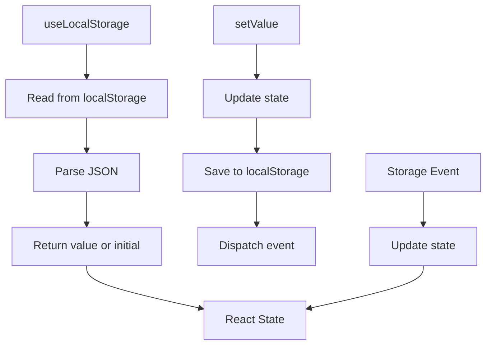
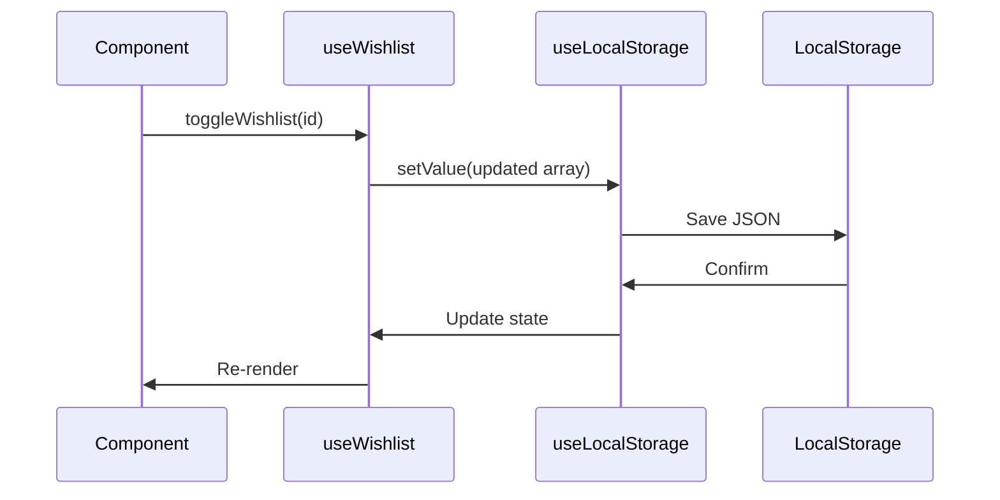
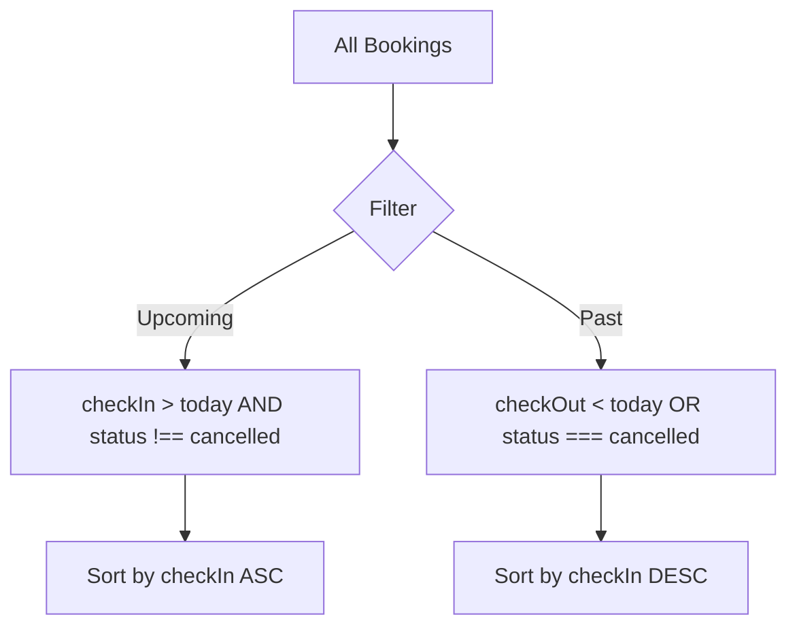
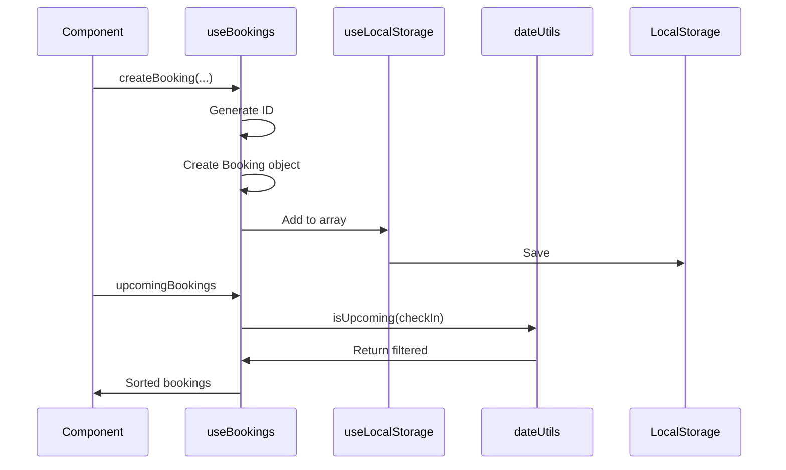
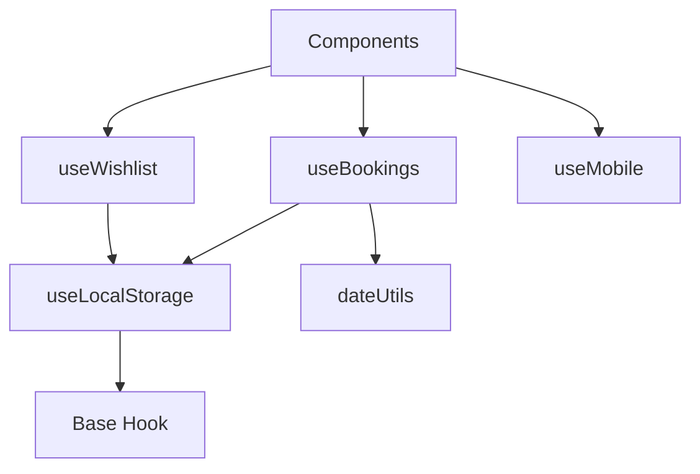
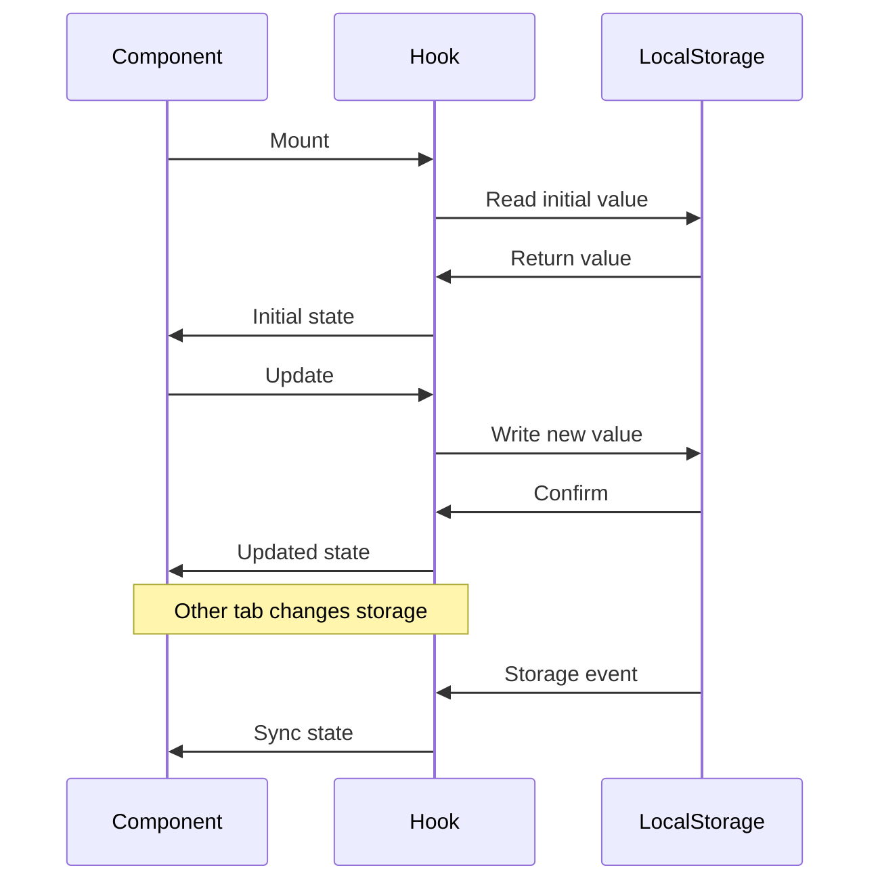

<div align="center">

# 🎣 Custom Hooks

**Complete API documentation for StayFinder's custom React hooks**

[← Documentation Home](./README.md) • [API & Data →](./api-data.md)

</div>

---

## 📚 Hooks Overview

StayFinder provides custom React hooks for managing application state and business logic. All hooks follow React best practices and provide type-safe APIs.

### Available Hooks

| Hook | Purpose | Location |
|------|---------|----------|
| **useLocalStorage** | Persistent storage wrapper | `src/hooks/useLocalStorage.ts` |
| **useWishlist** | Wishlist management | `src/hooks/useWishlist.ts` |
| **useBookings** | Booking management | `src/hooks/useBookings.ts` |
| **useMobile** | Mobile detection | `src/hooks/use-mobile.tsx` |

---

## 💾 useLocalStorage

Base hook for localStorage persistence with React state synchronization.

### API

```typescript
function useLocalStorage<T>(
  key: string,
  initialValue: T
): [T, (value: T | ((prev: T) => T)) => void]
```

### Parameters

| Parameter | Type | Description |
|-----------|------|-------------|
| `key` | `string` | localStorage key |
| `initialValue` | `T` | Default value if key doesn't exist |

### Returns

- `[0]` - Current stored value
- `[1]` - Setter function (supports functional updates)

### Features

- ✅ **Type-safe** - Full TypeScript support
- ✅ **SSR-safe** - Handles server-side rendering
- ✅ **Cross-tab sync** - Listens to storage events
- ✅ **Error handling** - Graceful fallback on errors

### Usage

```typescript
import { useLocalStorage } from '@/hooks/useLocalStorage';

function MyComponent() {
  const [value, setValue] = useLocalStorage('my-key', 'default');
  
  // Update value
  setValue('new value');
  
  // Functional update
  setValue(prev => prev + ' updated');
  
  return <div>{value}</div>;
}
```

### Implementation Details



### Storage Event Handling

The hook listens to:
- **`storage` event** - Changes from other tabs
- **`local-storage` event** - Changes from same tab

---

## ❤️ useWishlist

Manages user's wishlist (saved listings) with localStorage persistence.

### API

```typescript
function useWishlist(): {
  wishlist: string[];
  addToWishlist: (listingId: string) => void;
  removeFromWishlist: (listingId: string) => void;
  toggleWishlist: (listingId: string) => void;
  isInWishlist: (listingId: string) => boolean;
  clearWishlist: () => void;
}
```

### Returns

| Property | Type | Description |
|---------|------|-------------|
| `wishlist` | `string[]` | Array of listing IDs |
| `addToWishlist` | `(id: string) => void` | Add listing to wishlist |
| `removeFromWishlist` | `(id: string) => void` | Remove listing from wishlist |
| `toggleWishlist` | `(id: string) => void` | Toggle listing in wishlist |
| `isInWishlist` | `(id: string) => boolean` | Check if listing is in wishlist |
| `clearWishlist` | `() => void` | Clear entire wishlist |

### Usage

```typescript
import { useWishlist } from '@/hooks/useWishlist';

function ListingCard({ listing }) {
  const { isInWishlist, toggleWishlist } = useWishlist();
  const isSaved = isInWishlist(listing.id);
  
  return (
    <button onClick={() => toggleWishlist(listing.id)}>
      {isSaved ? 'Remove from wishlist' : 'Add to wishlist'}
    </button>
  );
}
```

### Data Flow



### Storage Key

Uses `STORAGE_KEYS.WISHLIST` constant: `'stayfinder_wishlist'`

### Example: Full Wishlist Management

```typescript
function WishlistPage() {
  const { wishlist, clearWishlist } = useWishlist();
  
  return (
    <div>
      <h1>My Wishlist ({wishlist.length})</h1>
      {wishlist.length > 0 && (
        <button onClick={clearWishlist}>Clear All</button>
      )}
    </div>
  );
}
```

---

## 📅 useBookings

Manages user's bookings (trips) with filtering and status management.

### API

```typescript
function useBookings(): {
  bookings: Booking[];
  upcomingBookings: Booking[];
  pastBookings: Booking[];
  createBooking: (
    listing: Listing,
    checkIn: string,
    checkOut: string,
    guests: number,
    totalPrice: number
  ) => Booking;
  cancelBooking: (bookingId: string) => void;
  getBookingById: (id: string) => Booking | undefined;
}
```

### Returns

| Property | Type | Description |
|---------|------|-------------|
| `bookings` | `Booking[]` | All bookings |
| `upcomingBookings` | `Booking[]` | Future bookings (sorted) |
| `pastBookings` | `Booking[]` | Past/cancelled bookings (sorted) |
| `createBooking` | `(...) => Booking` | Create new booking |
| `cancelBooking` | `(id: string) => void` | Cancel a booking |
| `getBookingById` | `(id: string) => Booking?` | Get booking by ID |

### Usage

```typescript
import { useBookings } from '@/hooks/useBookings';

function ListingPage({ listing }) {
  const { createBooking } = useBookings();
  const [checkIn, setCheckIn] = useState('');
  const [checkOut, setCheckOut] = useState('');
  const [guests, setGuests] = useState(2);
  
  const handleBook = () => {
    const totalPrice = calculateTotal(listing, checkIn, checkOut);
    const booking = createBooking(
      listing,
      checkIn,
      checkOut,
      guests,
      totalPrice
    );
    // Booking created and saved
  };
  
  return <button onClick={handleBook}>Reserve</button>;
}
```

### Booking Status

Bookings can have three statuses:

- `'confirmed'` - Active booking
- `'cancelled'` - Cancelled booking
- `'completed'` - Past booking

### Filtering Logic



### Data Flow



### Booking ID Generation

```typescript
const bookingId = `booking_${Date.now()}_${Math.random().toString(36).substr(2, 9)}`;
```

### Example: Trips Page

```typescript
function TripsPage() {
  const { upcomingBookings, pastBookings, cancelBooking } = useBookings();
  
  return (
    <div>
      <h1>Upcoming Trips</h1>
      {upcomingBookings.map(booking => (
        <TripCard 
          key={booking.id} 
          booking={booking}
          onCancel={() => cancelBooking(booking.id)}
        />
      ))}
      
      <h1>Past Trips</h1>
      {pastBookings.map(booking => (
        <TripCard key={booking.id} booking={booking} />
      ))}
    </div>
  );
}
```

---

## 📱 useMobile

Detects if the user is on a mobile device.

### API

```typescript
function useMobile(): boolean
```

### Returns

- `boolean` - `true` if mobile device, `false` otherwise

### Usage

```typescript
import { useMobile } from '@/hooks/use-mobile';

function ResponsiveComponent() {
  const isMobile = useMobile();
  
  return (
    <div className={isMobile ? 'mobile-layout' : 'desktop-layout'}>
      Content
    </div>
  );
}
```

### Implementation

Uses window width breakpoint (typically 768px) to detect mobile devices.

---

## 🔗 Hook Dependencies



---

## 🎯 Best Practices

### 1. Use Hooks at Component Top Level

```typescript
// ✅ Good
function Component() {
  const { wishlist } = useWishlist();
  // ...
}

// ❌ Bad
function Component() {
  if (condition) {
    const { wishlist } = useWishlist(); // Don't do this
  }
}
```

### 2. Memoize Expensive Operations

```typescript
const filteredBookings = useMemo(
  () => bookings.filter(b => b.status === 'confirmed'),
  [bookings]
);
```

### 3. Use Functional Updates

```typescript
// ✅ Good - for complex updates
setWishlist(prev => {
  if (prev.includes(id)) return prev;
  return [...prev, id];
});

// ✅ Also good - for simple updates
setWishlist([...wishlist, id]);
```

### 4. Handle Loading States

```typescript
const [wishlist, setWishlist] = useLocalStorage('wishlist', []);
const isLoading = wishlist === null; // Handle initial load
```

---

## 🧪 Testing Hooks

### Example Test Structure

```typescript
import { renderHook, act } from '@testing-library/react';
import { useWishlist } from '@/hooks/useWishlist';

test('adds listing to wishlist', () => {
  const { result } = renderHook(() => useWishlist());
  
  act(() => {
    result.current.addToWishlist('listing-1');
  });
  
  expect(result.current.isInWishlist('listing-1')).toBe(true);
});
```

---

## 🔄 Hook Lifecycle



---

## 📊 Storage Schema

### Wishlist Storage

```json
{
  "stayfinder_wishlist": ["listing-1", "listing-2", "listing-3"]
}
```

### Bookings Storage

```json
{
  "stayfinder_bookings": [
    {
      "id": "booking_1234567890_abc123",
      "listingId": "listing-1",
      "listing": { /* full listing object */ },
      "checkIn": "2024-01-15",
      "checkOut": "2024-01-20",
      "guests": 2,
      "totalPrice": 500,
      "status": "confirmed",
      "createdAt": "2024-01-01T00:00:00.000Z"
    }
  ]
}
```

---

<div align="center">

**Next:** Learn about [API & Data Structures](./api-data.md) →

</div>

