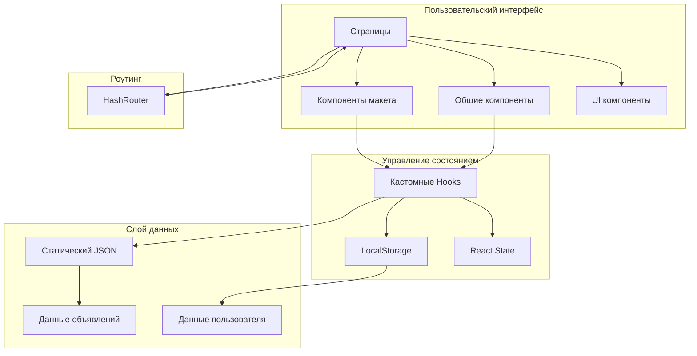

<div align="center">

# 📚 Документация StayFinder

**Полное руководство по пониманию, разработке и развертыванию StayFinder**

[← Назад к главному README](../README.md) • [English](./../README.md)

</div>

---

## 🗺️ Обзор документации

Добро пожаловать в документацию StayFinder! Это полное руководство охватывает всё, что нужно знать о проекте, от быстрого старта до продвинутых стратегий развертывания.

### 📑 Содержание

| Документ | Описание |
|----------|----------|
| [🚀 Быстрый старт](./getting-started.md) | Руководство по быстрому старту, установке и первым шагам |
| [🏗️ Архитектура](./architecture.md) | Структура проекта, паттерны проектирования и архитектура системы |
| [🧩 Компоненты](./components.md) | Полная документация библиотеки компонентов |
| [🎣 Hooks](./hooks.md) | API и использование кастомных React hooks |
| [📊 API и данные](./api-data.md) | Структуры данных, типы и потоки данных |
| [🚢 Развертывание](./deployment.md) | Руководство по развертыванию на GitHub Pages |

---

## 🎯 Обзор проекта

StayFinder — это современное демонстрационное приложение для бронирования, которое демонстрирует:

- **Архитектура только фронтенда** - Бэкенд не требуется, использует localStorage для сохранения данных
- **Компонентный дизайн** - Построен на React и компонентах shadcn/ui
- **Типобезопасная разработка** - Полное покрытие TypeScript
- **Современные инструменты** - Vite для быстрой разработки и оптимизированных сборок
- **Возможности PWA** - Устанавливается как Progressive Web App

### 🏗️ Высокоуровневая архитектура



---

## 📂 Структура проекта

```
stay-finder-delight/
├── 📁 public/              # Статические ресурсы
│   ├── favicon.svg        # Иконка приложения (метка локации)
│   ├── site.webmanifest   # PWA манифест
│   └── robots.txt         # SEO конфигурация
│
├── 📁 src/
│   ├── 📁 components/      # React компоненты
│   │   ├── 📁 common/      # Общие бизнес-компоненты
│   │   │   ├── ListingCard.tsx
│   │   │   └── SearchForm.tsx
│   │   ├── 📁 layout/      # Компоненты макета
│   │   │   ├── Layout.tsx
│   │   │   ├── Navbar.tsx
│   │   │   └── Footer.tsx
│   │   ├── NavLink.tsx     # Кастомная навигационная ссылка
│   │   └── 📁 ui/          # shadcn/ui компоненты (50+ компонентов)
│   │
│   ├── 📁 data/            # Статические данные
│   │   └── listings.json   # Объявления о размещении
│   │
│   ├── 📁 hooks/           # Кастомные React hooks
│   │   ├── useWishlist.ts
│   │   ├── useBookings.ts
│   │   ├── useLocalStorage.ts
│   │   └── use-mobile.tsx
│   │
│   ├── 📁 lib/             # Утилиты и помощники
│   │   ├── constants.ts    # Константы приложения
│   │   ├── formatters.ts   # Утилиты форматирования
│   │   ├── dateUtils.ts    # Помощники для дат
│   │   ├── queryParams.ts  # Обработка URL запросов
│   │   ├── storage.ts      # Помощники для хранилища
│   │   └── utils.ts        # Общие утилиты
│   │
│   ├── 📁 pages/           # Компоненты страниц
│   │   ├── Home.tsx
│   │   ├── Search.tsx
│   │   ├── Listing.tsx
│   │   ├── Trips.tsx
│   │   └── Wishlist.tsx
│   │
│   └── 📁 types/           # Определения TypeScript
│       └── index.ts
│
├── 📁 docs/                # Документация (вы здесь!)
│
├── 📁 .github/
│   └── 📁 workflows/
│       └── deploy-pages.yml # GitHub Actions workflow
│
└── Файлы конфигурации
    ├── vite.config.ts      # Конфигурация Vite
    ├── tailwind.config.ts  # Конфигурация Tailwind CSS
    └── tsconfig.json       # Конфигурация TypeScript
```

---

## 🔑 Ключевые концепции

### Компонентная архитектура

StayFinder следует **компонентной архитектуре** с четким разделением ответственности:

- **Pages** - Компоненты маршрутов верхнего уровня
- **Layout Components** - Структура и навигация
- **Common Components** - Переиспользуемые бизнес-компоненты
- **UI Components** - Низкоуровневые примитивы shadcn/ui

### Управление состоянием

Приложение использует **гибридный подход к управлению состоянием**:

- **Локальное состояние** - React `useState` для состояния компонента
- **LocalStorage** - Кастомные hooks для постоянных данных (избранное, бронирования)
- **URL состояние** - Параметры запроса для фильтров поиска

### Стратегия роутинга

Использует **HashRouter** вместо BrowserRouter для:
- Избежания ошибок 404 на GitHub Pages
- Работы со статическим хостингом
- Включения глубоких ссылок без конфигурации сервера

---

## 🛠️ Технологический стек

<div align="center">

| Слой | Технология | Назначение |
|-------|-----------|---------|
| **Фреймворк** | React 18.3 | UI библиотека |
| **Язык** | TypeScript 5.8 | Типобезопасность |
| **Инструмент сборки** | Vite 5.4 | Быстрый dev сервер и сборка |
| **UI библиотека** | shadcn/ui | Примитивы компонентов |
| **Стилизация** | Tailwind CSS 3.4 | Utility-first CSS |
| **Роутинг** | React Router 6.30 | Клиентский роутинг |
| **Иконки** | Lucide React | Библиотека иконок |
| **Формы** | React Hook Form + Zod | Обработка и валидация форм |
| **Утилиты дат** | date-fns 3.6 | Работа с датами |

</div>

---

## 📖 Быстрые ссылки

### Для разработчиков

- 🚀 [Руководство по быстрому старту](./getting-started.md) - Настройка окружения разработки
- 🏗️ [Глубокое погружение в архитектуру](./architecture.md) - Понимание дизайна системы
- 🧩 [Справочник компонентов](./components.md) - Просмотр доступных компонентов
- 🎣 [API Hooks](./hooks.md) - Изучение кастомных hooks

### Для развертывания

- 🚢 [Руководство по развертыванию](./deployment.md) - Развертывание на GitHub Pages
- 📊 [Структуры данных](./api-data.md) - Понимание форматов данных

---

## 💡 Лучшие практики

При работе со StayFinder помните о следующих практиках:

1. **Типобезопасность прежде всего** - Всегда используйте типы TypeScript
2. **Переиспользование компонентов** - Предпочитайте композицию дублированию
3. **Производительность** - Используйте React.memo и useMemo где уместно
4. **Доступность** - Следуйте рекомендациям ARIA (shadcn/ui это обрабатывает)
5. **Организация кода** - Держите связанные файлы вместе

---

## 🤝 Вклад в проект

Хотя это демо-проект, вклад приветствуется! При внесении вклада:

1. Следуйте существующему стилю кода
2. Добавляйте типы TypeScript для новых функций
3. Обновляйте документацию по мере необходимости
4. Тщательно тестируйте свои изменения

---

## 📞 Поддержка

По вопросам или проблемам:

1. Проверьте соответствующий раздел документации
2. Изучите [Руководство по архитектуре](./architecture.md) для дизайна системы
3. Изучите [Документацию компонентов](./components.md) для примеров использования

---

<div align="center">

**Готовы начать?** Начните с [Руководства по быстрому старту](./getting-started.md) →

</div>

