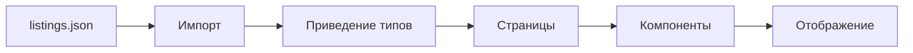
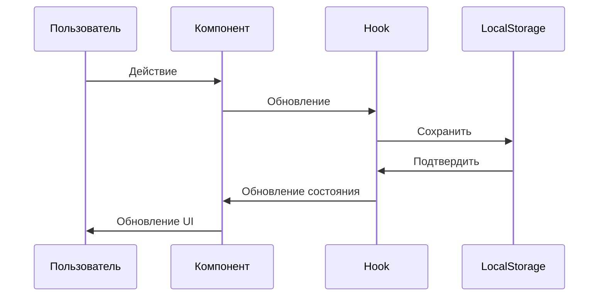
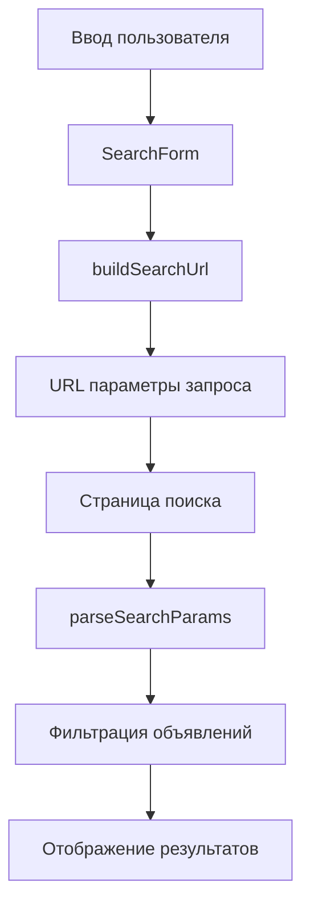

<div align="center">

# 📊 API и структуры данных

**Полный справочник по типам данных, структурам и потокам данных в StayFinder**

[← Домашняя страница документации](./README.md) • [Развертывание →](./deployment.md)

</div>

---

## 📚 Обзор данных

StayFinder использует **архитектуру только фронтенда** с:

- **Статические JSON данные** - Объявления хранятся в `src/data/listings.json`
- **LocalStorage** - Данные пользователя (избранное, бронирования) сохраняются в браузере
- **TypeScript типы** - Полные определения типов в `src/types/index.ts`

---

## 🏠 Структура данных объявления

### Интерфейс Listing

```typescript
interface Listing {
  id: string;
  title: string;
  city: string;
  country: string;
  area: string;
  type: "apartment" | "house" | "hotel";
  coords: { lat: number; lng: number };
  pricePerNight: number;
  rating: number;
  reviewsCount: number;
  images: string[];
  maxGuests: number;
  bedrooms: number;
  beds: number;
  baths: number;
  amenities: string[];
  host: Host;
  policies: Policies;
  fees: Fees;
  areaHighlights: AreaHighlight[];
  reviews: Review[];
  instantBook: boolean;
  freeCancellation: boolean;
  description: string;
}
```

### Описание полей

| Поле               | Тип                                 | Описание                            |
| ------------------ | ----------------------------------- | ----------------------------------- |
| `id`               | `string`                            | Уникальный идентификатор объявления |
| `title`            | `string`                            | Заголовок/название объявления       |
| `city`             | `string`                            | Название города                     |
| `country`          | `string`                            | Название страны                     |
| `area`             | `string`                            | Название района/области             |
| `type`             | `'apartment' \| 'house' \| 'hotel'` | Тип недвижимости                    |
| `coords`           | `{ lat: number; lng: number }`      | Географические координаты           |
| `pricePerNight`    | `number`                            | Цена за ночь в базовой валюте       |
| `rating`           | `number`                            | Средний рейтинг (0-5)               |
| `reviewsCount`     | `number`                            | Общее количество отзывов            |
| `images`           | `string[]`                          | Массив URL изображений              |
| `maxGuests`        | `number`                            | Максимальная вместимость гостей     |
| `bedrooms`         | `number`                            | Количество спален                   |
| `beds`             | `number`                            | Количество кроватей                 |
| `baths`            | `number`                            | Количество ванных комнат            |
| `amenities`        | `string[]`                          | Массив ID удобств                   |
| `host`             | `Host`                              | Объект информации о хозяине         |
| `policies`         | `Policies`                          | Правила отмены и проживания         |
| `fees`             | `Fees`                              | Структура дополнительных сборов     |
| `areaHighlights`   | `AreaHighlight[]`                   | Близлежащие достопримечательности   |
| `reviews`          | `Review[]`                          | Массив объектов отзывов             |
| `instantBook`      | `boolean`                           | Доступно мгновенное бронирование    |
| `freeCancellation` | `boolean`                           | Доступна бесплатная отмена          |
| `description`      | `string`                            | Полное описание объявления          |

---

## 👤 Интерфейс Host

```typescript
interface Host {
  name: string;
  avatar: string;
  isSuperhost: boolean;
}
```

### Пример

```json
{
  "name": "Marie",
  "avatar": "https://i.pravatar.cc/150?u=marie",
  "isSuperhost": true
}
```

---

## ⭐ Интерфейс Review

```typescript
interface Review {
  id: string;
  authorName: string;
  authorAvatar: string;
  rating: number;
  date: string;
  text: string;
}
```

### Пример

```json
{
  "id": "r1",
  "authorName": "John",
  "authorAvatar": "https://i.pravatar.cc/150?u=john",
  "rating": 5,
  "date": "2025-12-15",
  "text": "Потрясающее местоположение и красивая квартира!"
}
```

---

## 💰 Интерфейс Fees

```typescript
interface Fees {
  cleaning: number;
  service: number;
  discountPercent: number;
}
```

### Пример

```json
{
  "cleaning": 45,
  "service": 25,
  "discountPercent": 10
}
```

### Расчет цены

```typescript
const nights = calculateNights(checkIn, checkOut);
const subtotal = listing.pricePerNight * nights;
const cleaning = listing.fees.cleaning;
const service = listing.fees.service;
const discount = (subtotal * listing.fees.discountPercent) / 100;
const total = subtotal + cleaning + service - discount;
```

---

## 📋 Интерфейс Policies

```typescript
interface Policies {
  cancellation: string;
  houseRules: string[];
}
```

### Пример

```json
{
  "cancellation": "Бесплатная отмена в течение 48 часов",
  "houseRules": ["Не курить", "Без вечеринок", "Заезд после 15:00"]
}
```

---

## 🗺️ Интерфейс AreaHighlight

```typescript
interface AreaHighlight {
  name: string;
  distance: string;
  type: "restaurant" | "attraction" | "transport" | "shopping" | "nature";
}
```

### Пример

```json
{
  "name": "Эйфелева башня",
  "distance": "0.5 км",
  "type": "attraction"
}
```

### Типы

- `'restaurant'` - Рестораны и кафе
- `'attraction'` - Туристические достопримечательности
- `'transport'` - Станции общественного транспорта
- `'shopping'` - Торговые районы
- `'nature'` - Парки и природные места

---

## 📅 Интерфейс Booking

```typescript
interface Booking {
  id: string;
  listingId: string;
  listing: Listing;
  checkIn: string;
  checkOut: string;
  guests: number;
  totalPrice: number;
  status: "confirmed" | "cancelled" | "completed";
  createdAt: string;
}
```

### Значения статуса

| Статус        | Описание                           |
| ------------- | ---------------------------------- |
| `'confirmed'` | Активное, предстоящее бронирование |
| `'cancelled'` | Отмененное пользователем           |
| `'completed'` | Прошедшее бронирование             |

### Формат ID бронирования

```typescript
const bookingId = `booking_${Date.now()}_${Math.random().toString(36).substr(2, 9)}`;
// Пример: "booking_1704067200000_abc123xyz"
```

---

## 🔍 Параметры поиска

```typescript
interface SearchParams {
  location?: string;
  checkIn?: string;
  checkOut?: string;
  guests?: number;
}
```

### Формат URL

```
/#/search?location=Paris&checkIn=2024-01-15&checkOut=2024-01-20&guests=2
```

---

## 🎛️ Параметры фильтра

```typescript
interface FilterParams {
  priceMin?: number;
  priceMax?: number;
  type?: ("apartment" | "house" | "hotel")[];
  minRating?: number;
  amenities?: string[];
  instantBook?: boolean;
}
```

---

## 🏷️ Удобства

Доступные ID удобств (из `src/lib/constants.ts`):

| ID                | Метка               | Иконка          |
| ----------------- | ------------------- | --------------- |
| `wifi`            | WiFi                | Wifi            |
| `kitchen`         | Кухня               | UtensilsCrossed |
| `parking`         | Бесплатная парковка | Car             |
| `pool`            | Бассейн             | Waves           |
| `petFriendly`     | Разрешены животные  | PawPrint        |
| `airConditioning` | Кондиционер         | Wind            |
| `washer`          | Стиральная машина   | WashingMachine  |
| `tv`              | Телевизор           | Tv              |
| `heating`         | Отопление           | Flame           |
| `workspace`       | Рабочее место       | Laptop          |

---

## 📦 Хранение данных

### Ключи LocalStorage

```typescript
export const STORAGE_KEYS = {
  WISHLIST: "stayfinder_wishlist",
  BOOKINGS: "stayfinder_bookings",
  RECENT_SEARCHES: "stayfinder_recent_searches",
  RECENTLY_VIEWED: "stayfinder_recently_viewed",
} as const;
```

### Схема хранилища

#### Избранное

```json
{
  "stayfinder_wishlist": ["listing-1", "listing-2", "listing-3"]
}
```

**Тип:** `string[]` (массив ID объявлений)

#### Бронирования

```json
{
  "stayfinder_bookings": [
    {
      "id": "booking_1704067200000_abc123",
      "listingId": "paris-1",
      "listing": {
        /* полный объект Listing */
      },
      "checkIn": "2024-01-15",
      "checkOut": "2024-01-20",
      "guests": 2,
      "totalPrice": 500,
      "status": "confirmed",
      "createdAt": "2024-01-01T00:00:00.000Z"
    }
  ]
}
```

**Тип:** `Booking[]`

---

## 🔄 Поток данных

### Поток данных объявлений



### Поток данных пользователя



### Поток поиска



---

## 📝 Определения типов

### Полный файл типов

Расположение: `src/types/index.ts`

```typescript
export interface Host {
  /* ... */
}
export interface Review {
  /* ... */
}
export interface Fees {
  /* ... */
}
export interface Policies {
  /* ... */
}
export interface AreaHighlight {
  /* ... */
}
export interface Listing {
  /* ... */
}
export interface Booking {
  /* ... */
}
export interface SearchParams {
  /* ... */
}
export interface FilterParams {
  /* ... */
}
export type SortOption = "recommended" | "price_asc" | "rating" | "reviews";
```

---

## 🎯 Валидация данных

### Типобезопасность

Все данные валидируются через TypeScript:

```typescript
// Приведение типов при импорте JSON
import listings from "@/data/listings.json";
const typedListings = listings as Listing[];

// Проверка типов в функциях
function filterListings(listings: Listing[]): Listing[] {
  // TypeScript обеспечивает правильную структуру
}
```

### Валидация во время выполнения

Для пользовательского ввода рекомендуется использовать схемы Zod:

```typescript
import { z } from "zod";

const searchParamsSchema = z.object({
  location: z.string().optional(),
  checkIn: z.string().optional(),
  checkOut: z.string().optional(),
  guests: z.number().min(1).max(16).optional(),
});
```

---

## 📊 Примеры данных

### Полный пример объявления

```json
{
  "id": "paris-1",
  "title": "Элегантная парижская квартира рядом с Эйфелевой башней",
  "city": "Paris",
  "country": "France",
  "area": "7th Arrondissement",
  "type": "apartment",
  "coords": { "lat": 48.8584, "lng": 2.2945 },
  "pricePerNight": 185,
  "rating": 4.92,
  "reviewsCount": 324,
  "images": ["https://images.unsplash.com/photo-1502672260266-1c1ef2d93688?w=800"],
  "maxGuests": 4,
  "bedrooms": 2,
  "beds": 2,
  "baths": 1,
  "amenities": ["wifi", "kitchen", "airConditioning"],
  "host": {
    "name": "Marie",
    "avatar": "https://i.pravatar.cc/150?u=marie",
    "isSuperhost": true
  },
  "policies": {
    "cancellation": "Бесплатная отмена в течение 48 часов",
    "houseRules": ["Не курить", "Без вечеринок"]
  },
  "fees": {
    "cleaning": 45,
    "service": 25,
    "discountPercent": 10
  },
  "areaHighlights": [
    {
      "name": "Эйфелева башня",
      "distance": "0.5 км",
      "type": "attraction"
    }
  ],
  "reviews": [
    {
      "id": "r1",
      "authorName": "John",
      "authorAvatar": "https://i.pravatar.cc/150?u=john",
      "rating": 5,
      "date": "2025-12-15",
      "text": "Потрясающее местоположение!"
    }
  ],
  "instantBook": true,
  "freeCancellation": true,
  "description": "Почувствуйте Париж как местный..."
}
```

---

## 🔧 Утилиты данных

### Форматтеры

Расположение: `src/lib/formatters.ts`

```typescript
formatPrice(amount: number): string
formatGuests(count: number): string
pluralize(word: string, count: number): string
```

### Утилиты дат

Расположение: `src/lib/dateUtils.ts`

```typescript
calculateNights(checkIn: string, checkOut: string): number
isUpcoming(date: string): boolean
isPast(date: string): boolean
getDefaultCheckIn(): string
getDefaultCheckOut(): string
getLocalTodayISODate(): string
```

### Параметры запроса

Расположение: `src/lib/queryParams.ts`

```typescript
buildSearchUrl(params: SearchParams): string
parseSearchParams(query: string): SearchParams
```

### Помощники хранилища

Расположение: `src/lib/storage.ts`

Вспомогательные функции для операций localStorage (используются внутри hooks):

```typescript
// Общие помощники
getStorageItem<T>(key: string, defaultValue: T): T
setStorageItem<T>(key: string, value: T): void

// Помощники избранного
getWishlist(): string[]
addToWishlist(listingId: string): void
removeFromWishlist(listingId: string): void
isInWishlist(listingId: string): boolean

// Помощники бронирований
getBookings(): Booking[]
saveBooking(booking: Booking): void
updateBookingStatus(bookingId: string, status: Booking['status']): void

// Недавние поиски
getRecentSearches(): SearchParams[]
addRecentSearch(search: SearchParams): void

// Недавно просмотренные
getRecentlyViewed(): string[]
addRecentlyViewed(listingId: string): void
```

> **Примечание:** Эти функции используются внутри hooks. Предпочтительно использовать hooks (`useWishlist`, `useBookings`) вместо прямого вызова этих функций.

---

## 🎨 Визуализация данных

### Структура данных объявления

```mermaid
graph TB
    A[Listing] --> B[Основная информация]
    A --> C[Местоположение]
    A --> D[Ценообразование]
    A --> E[Особенности]
    A --> F[Хозяин]
    A --> G[Отзывы]

    B --> B1[title, type, description]
    C --> C1[city, country, coords]
    D --> D1[pricePerNight, fees]
    E --> E1[amenities, bedrooms, beds]
    F --> F1[name, avatar, isSuperhost]
    G --> G1[rating, reviewsCount, reviews[]]
```

---

<div align="center">

**Следующее:** Изучите [Развертывание](./deployment.md) →

</div>
