<div align="center">

# 🏗️ Архитектура

**Дизайн системы, структура и архитектурные паттерны StayFinder**

[← Домашняя страница документации](./README.md) • [Компоненты →](./components.md)

</div>

---

## 📐 Обзор системы

StayFinder следует **компонентной архитектуре только фронтенда** с четким разделением ответственности. Приложение построено на React с TypeScript, используя современные паттерны и лучшие практики.

### Основные принципы

- 🧩 **Компонентная композиция** - Маленькие, переиспользуемые компоненты
- 📦 **Разделение ответственности** - Четкие границы между слоями
- 🔒 **Типобезопасность** - Полное покрытие TypeScript
- ⚡ **Производительность** - Оптимизированный рендеринг и ленивая загрузка
- 💾 **Локальное хранение** - localStorage для данных пользователя

---

## 🗂️ Структура проекта

```
stay-finder-delight/
│
├── 📁 public/                    # Статические ресурсы
│   ├── favicon.svg              # Иконка приложения
│   ├── site.webmanifest        # PWA манифест
│   └── robots.txt               # SEO конфигурация
│
├── 📁 src/
│   ├── 📁 components/           # React компоненты
│   │   ├── 📁 common/           # Бизнес-компоненты
│   │   │   ├── ListingCard.tsx  # Карточка объявления
│   │   │   └── SearchForm.tsx   # Форма поиска
│   │   │
│   │   ├── 📁 layout/           # Компоненты макета
│   │   │   ├── Layout.tsx       # Обертка макета
│   │   │   ├── Navbar.tsx       # Панель навигации
│   │   │   └── Footer.tsx       # Футер
│   │   │
│   │   ├── NavLink.tsx          # Кастомная ссылка навигации
│   │   │
│   │   └── 📁 ui/               # shadcn/ui примитивы (50+)
│   │       ├── button.tsx
│   │       ├── card.tsx
│   │       └── ...              # Еще UI компоненты
│   │
│   ├── 📁 data/                 # Статические данные
│   │   └── listings.json        # Объявления о размещении
│   │
│   ├── 📁 hooks/                # Кастомные React hooks
│   │   ├── useWishlist.ts       # Управление избранным
│   │   ├── useBookings.ts       # Управление бронированиями
│   │   ├── useLocalStorage.ts   # Обертка localStorage
│   │   └── use-mobile.tsx       # Определение мобильного устройства
│   │
│   ├── 📁 lib/                  # Утилиты и помощники
│   │   ├── constants.ts         # Константы приложения
│   │   ├── formatters.ts        # Функции форматирования
│   │   ├── dateUtils.ts         # Утилиты для дат
│   │   ├── queryParams.ts       # Обработка URL запросов
│   │   └── storage.ts           # Помощники для хранилища
│   │
│   ├── 📁 pages/                # Компоненты страниц
│   │   ├── Home.tsx             # Главная страница
│   │   ├── Search.tsx           # Результаты поиска
│   │   ├── Listing.tsx          # Детали объявления
│   │   ├── Trips.tsx            # Поездки пользователя
│   │   └── Wishlist.tsx         # Избранное пользователя
│   │
│   ├── 📁 types/                # Определения TypeScript
│   │   └── index.ts             # Все определения типов
│   │
│   ├── App.tsx                  # Главный компонент приложения
│   ├── main.tsx                 # Точка входа
│   └── index.css                # Глобальные стили
│
├── 📁 docs/                     # Документация
├── 📁 .github/workflows/        # CI/CD
│   └── deploy-pages.yml         # GitHub Actions
│
└── Файлы конфигурации
    ├── vite.config.ts          # Конфигурация Vite
    ├── tailwind.config.ts      # Конфигурация Tailwind
    └── tsconfig.json            # Конфигурация TypeScript
```

---

## 🏛️ Архитектурные слои

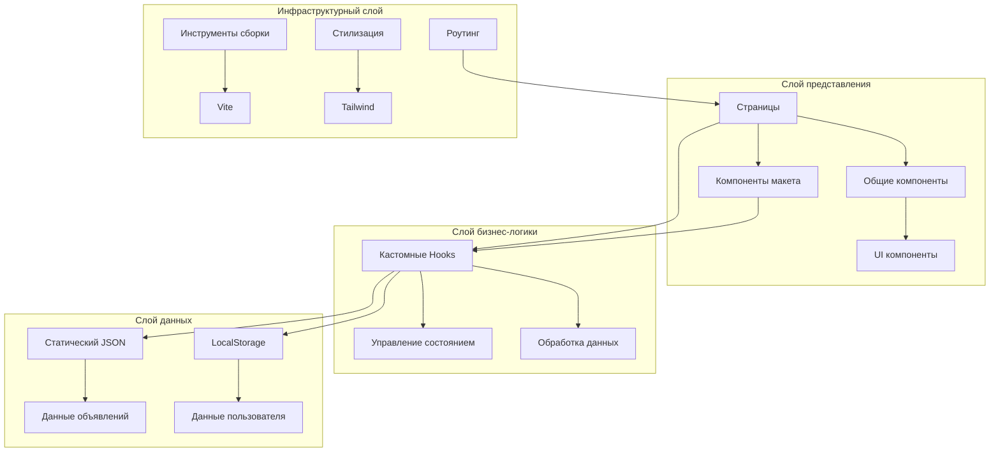

---

## 🔄 Поток данных

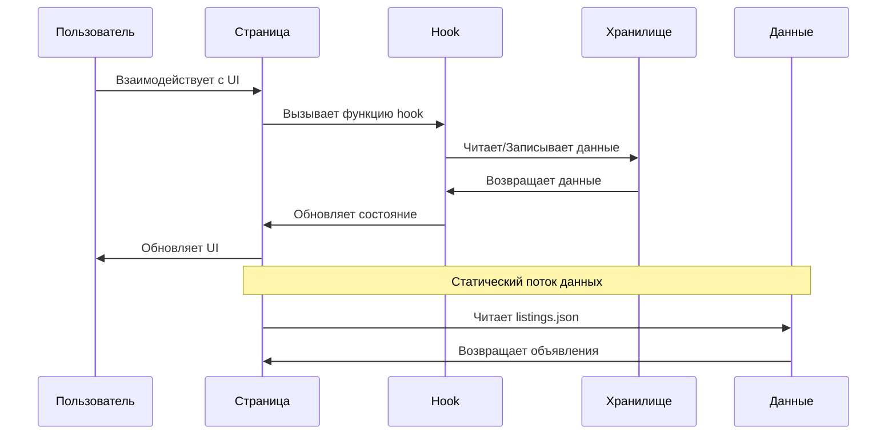

---

## 🧩 Компонентная архитектура

### Иерархия компонентов

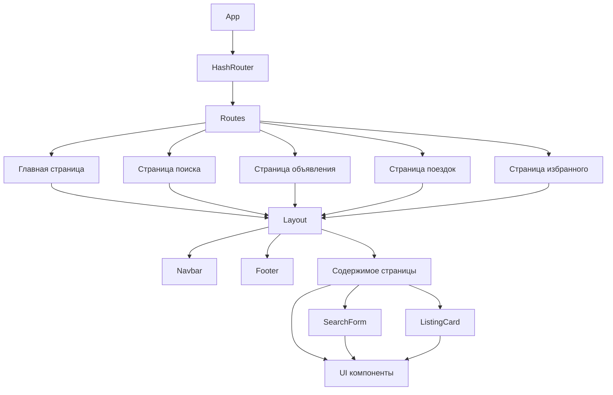

### Категории компонентов

| Категория  | Назначение                           | Примеры                             |
| ---------- | ------------------------------------ | ----------------------------------- |
| **Pages**  | Компоненты маршрутов верхнего уровня | `Home.tsx`, `Search.tsx`            |
| **Layout** | Структура и навигация                | `Layout.tsx`, `Navbar.tsx`          |
| **Common** | Переиспользуемые бизнес-компоненты   | `ListingCard.tsx`, `SearchForm.tsx` |
| **UI**     | Низкоуровневые примитивы             | `Button`, `Card`, `Dialog`          |

---

## 🔀 Архитектура роутинга

StayFinder использует **HashRouter** для клиентского роутинга:

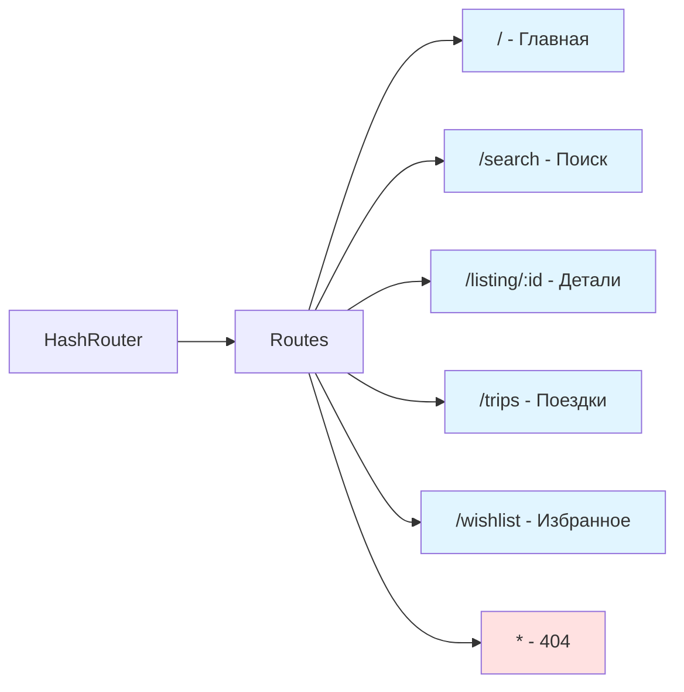

### Почему HashRouter?

- ✅ Работает со статическим хостингом (GitHub Pages)
- ✅ Не требуется конфигурация сервера
- ✅ Избегает ошибок 404 при обновлении
- ✅ Глубокие ссылки работают из коробки

---

## 💾 Управление состоянием

### Архитектура состояния

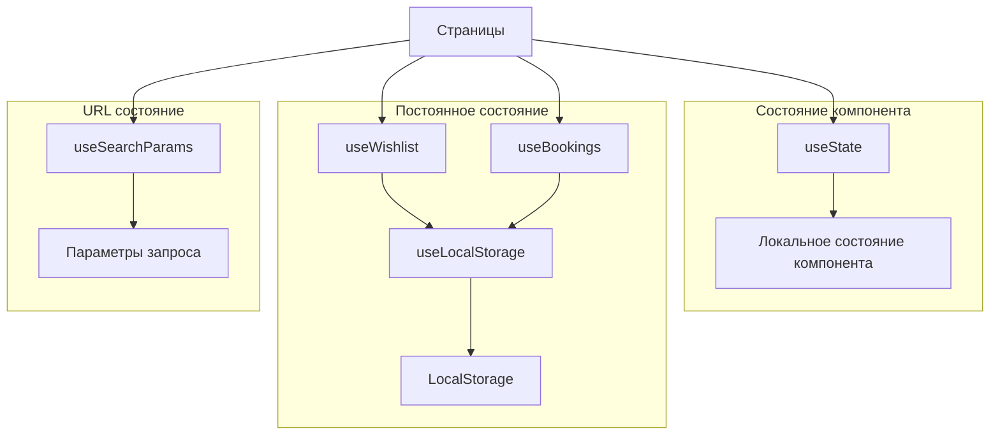

### Стратегия управления состоянием

| Тип состояния             | Решение           | Использование                      |
| ------------------------- | ----------------- | ---------------------------------- |
| **Состояние компонента**  | `useState`        | UI состояние, поля форм            |
| **Постоянное состояние**  | `useLocalStorage` | Избранное, бронирования            |
| **URL состояние**         | `useSearchParams` | Фильтры поиска, пагинация          |
| **Производное состояние** | `useMemo`         | Отфильтрованные списки, вычисления |

---

## 🎣 Архитектура Hooks

### Поток кастомных Hooks

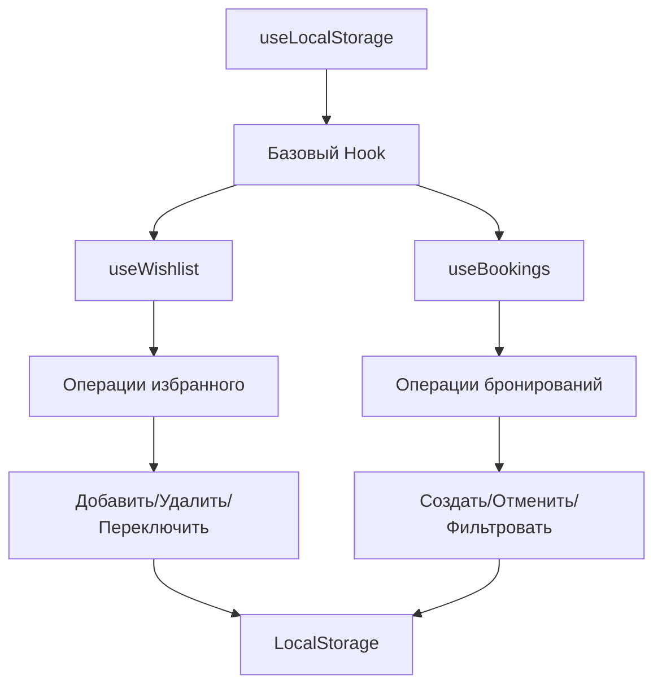

### Зависимости Hooks

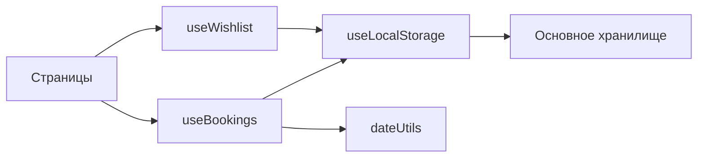

---

## 📊 Паттерны потока данных

### Поток поиска

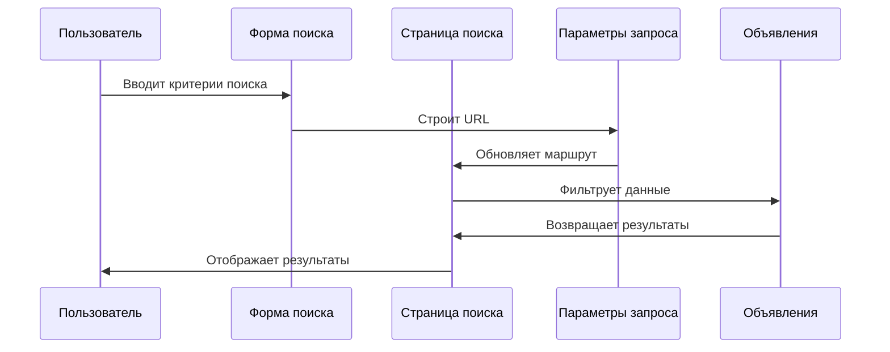

### Поток бронирования

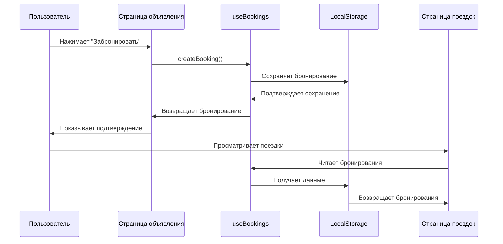

---

## 🎨 Архитектура стилизации

### Структура Tailwind CSS

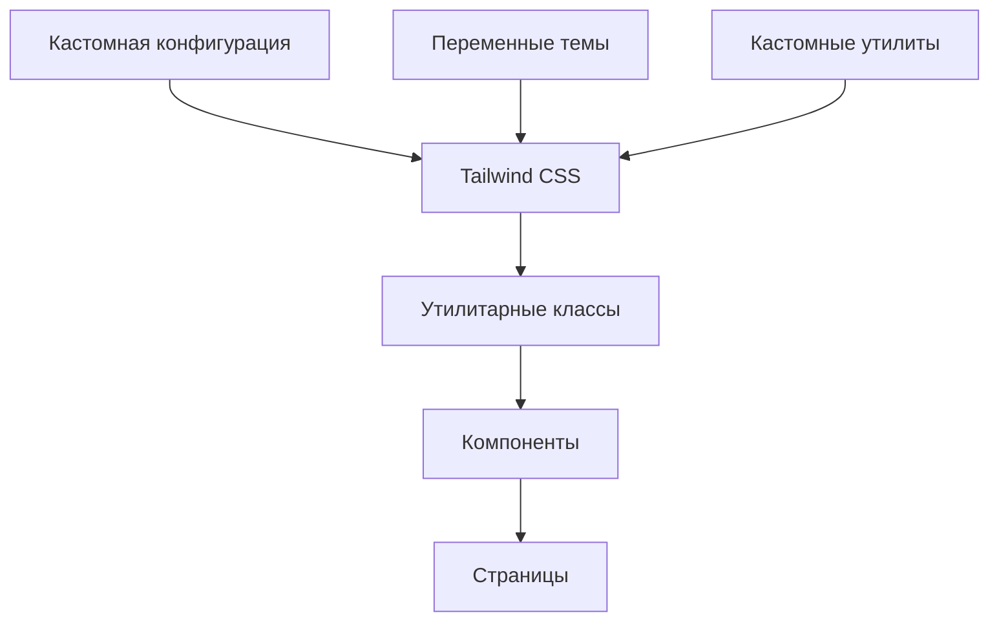

### Подход к стилизации

- **Utility-First** - Утилитарные классы Tailwind
- **Варианты компонентов** - Использование `class-variance-authority`
- **Система тем** - CSS переменные для темизации
- **Адаптивный дизайн** - Подход mobile-first

---

## ⚡ Оптимизация производительности

### Разделение кода

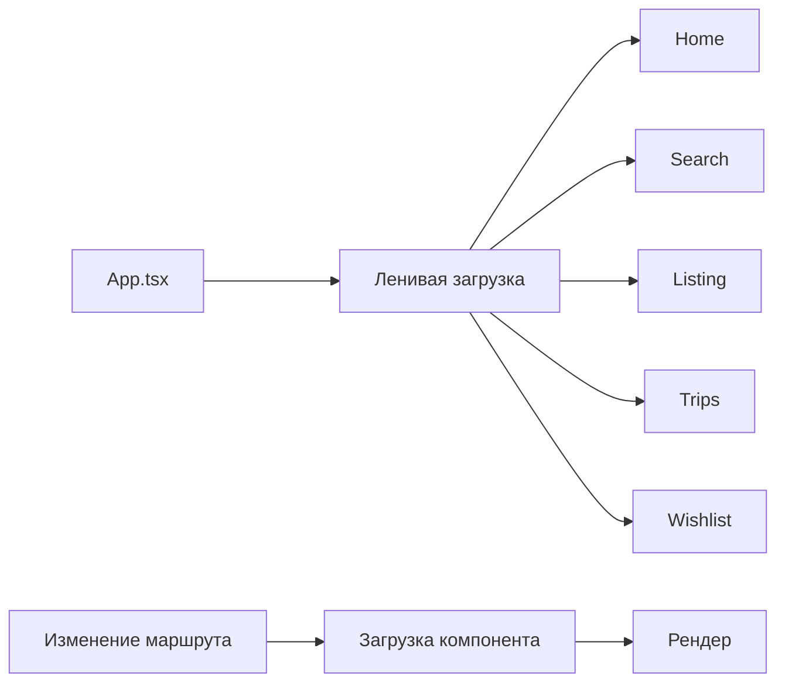

### Стратегии оптимизации

| Техника                     | Реализация               | Преимущество                      |
| --------------------------- | ------------------------ | --------------------------------- |
| **Ленивая загрузка**        | `React.lazy()`           | Меньший начальный бандл           |
| **Разделение кода**         | По маршрутам             | Загрузка по требованию            |
| **Мemoизация**              | `useMemo`, `useCallback` | Предотвращение повторных рендеров |
| **Оптимизация изображений** | Ленивая загрузка         | Быстрая загрузка страницы         |

---

## 🔐 Типобезопасность

### Архитектура TypeScript

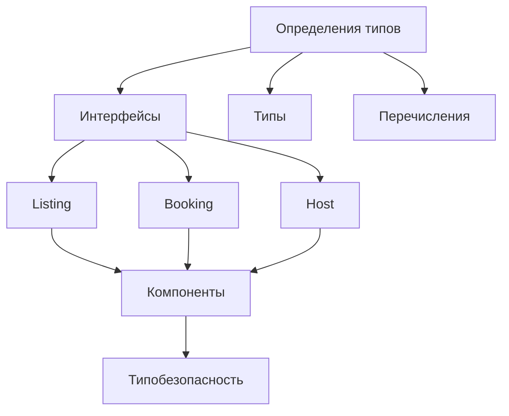

### Покрытие типами

- ✅ **100% покрытие типами** - Все файлы типизированы
- ✅ **Строгий режим** - TypeScript strict включен
- ✅ **Вывод типов** - Использует вывод типов TypeScript
- ✅ **Обобщенные типы** - Переиспользуемые паттерны типов

---

## 🚀 Сборка и развертывание

### Процесс сборки

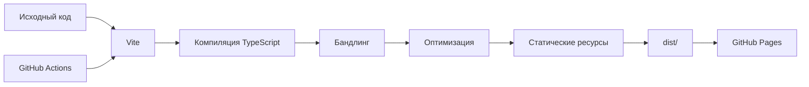

### Поток развертывания

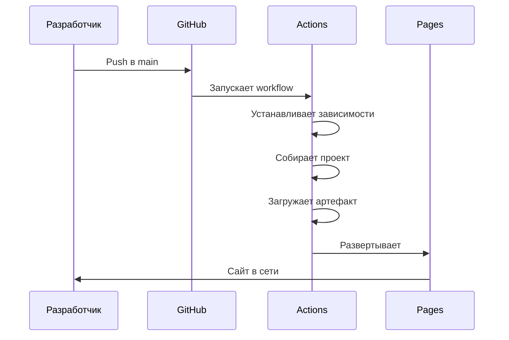

---

## 📦 Управление зависимостями

### Основные зависимости

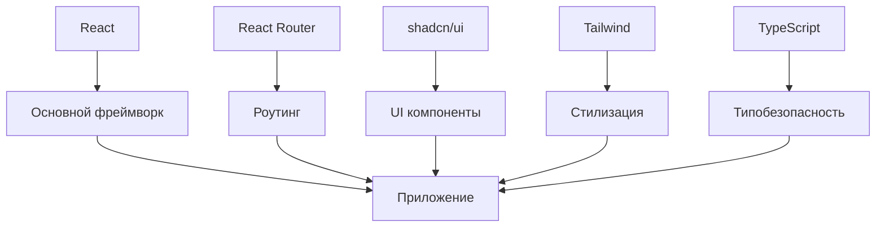

---

## 🎯 Паттерны проектирования

### Используемые паттерны

| Паттерн                     | Реализация                            | Назначение              |
| --------------------------- | ------------------------------------- | ----------------------- |
| **Компонентная композиция** | Маленькие, сфокусированные компоненты | Переиспользование       |
| **Кастомные Hooks**         | Извлечение бизнес-логики              | Организация кода        |
| **Higher-Order Components** | Обертка макета                        | Переиспользование кода  |
| **Render Props**            | Гибкий API компонентов                | Гибкость                |
| **Управляемые компоненты**  | Поля форм                             | Предсказуемое состояние |

---

## 🔄 Жизненный цикл и обновления

### Жизненный цикл компонента

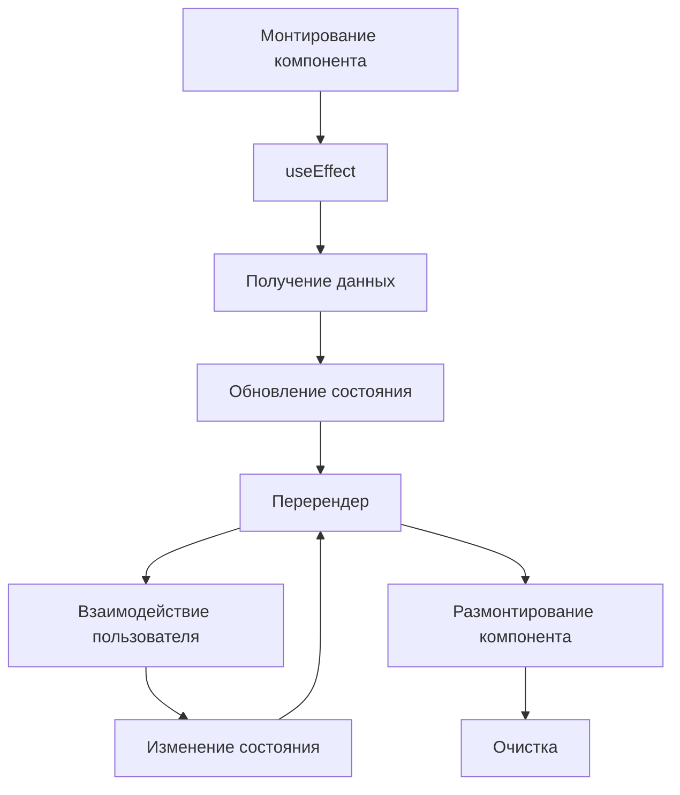

---

<div align="center">

**Следующее:** Изучите [Компоненты](./components.md) →

</div>
