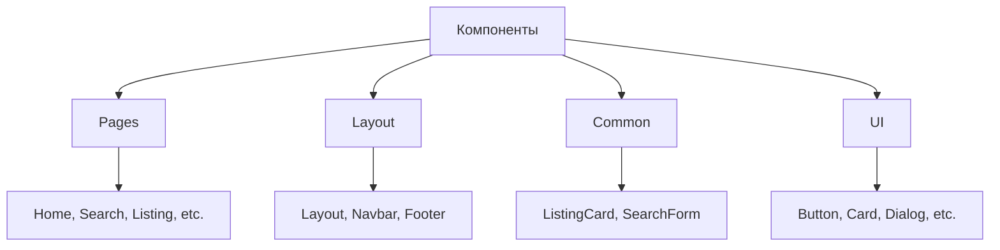
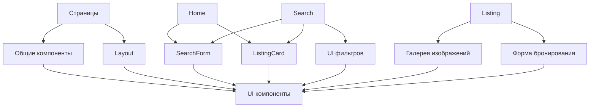

<div align="center">

# 🧩 Компоненты

**Полная документация библиотеки компонентов StayFinder**

[← Домашняя страница документации](./README.md) • [Hooks →](./hooks.md)

</div>

---

## 📚 Обзор компонентов

StayFinder использует **трехуровневую компонентную архитектуру**:

1. **Pages** - Компоненты маршрутов верхнего уровня
2. **Common Components** - Переиспользуемые бизнес-компоненты
3. **UI Components** - Низкоуровневые примитивы shadcn/ui

---

## 🎯 Категории компонентов



---

## 📄 Компоненты страниц

Компоненты страниц - это компоненты маршрутов верхнего уровня, представляющие полные страницы.

### Home

**Расположение:** `src/pages/Home.tsx`

Главная страница с:

- Hero секцией с формой поиска
- Популярными направлениями
- Рекомендуемыми размещениями
- Секцией преимуществ

**Возможности:**

- Отображает популярные направления из объявлений
- Показывает топовые рекомендуемые размещения
- Включает hero форму поиска

### Search

**Расположение:** `src/pages/Search.tsx`

Страница результатов поиска с фильтрацией и сортировкой:

- Форма поиска
- Боковая панель фильтров (цена, тип, рейтинг, удобства)
- Опции сортировки
- Пагинация
- Сетка результатов

**Props:** Нет (читает из URL query params)

**Управление состоянием:**

- Использует `useSearchParams` для URL состояния
- Локальное состояние для фильтров
- `useMemo` для отфильтрованных результатов

### Listing

**Расположение:** `src/pages/Listing.tsx`

Детальный просмотр объявления с:

- Галереей изображений с lightbox
- Формой бронирования
- Секцией отзывов
- Списком удобств
- Информацией о хозяине
- Достопримечательностями района

**Маршрут:** `/listing/:id`

**Возможности:**

- Карусель изображений
- Выбор дат для бронирования
- Выбор количества гостей
- Расчет цены
- Переключение избранного
- Создание бронирования

### Trips

**Расположение:** `src/pages/Trips.tsx`

Страница управления поездками пользователя:

- Предстоящие поездки
- Прошедшие поездки
- Отмена поездки
- Детали поездки

**Использует:** Hook `useBookings`

### Wishlist

**Расположение:** `src/pages/Wishlist.tsx`

Страница сохраненных объявлений:

- Сетка элементов из избранного
- Удаление из избранного
- Пустое состояние

**Использует:** Hook `useWishlist`

---

## 🏗️ Компоненты макета

### Layout

**Расположение:** `src/components/layout/Layout.tsx`

Главный компонент-обертка макета.

**Props:**

```typescript
interface LayoutProps {
  children: React.ReactNode;
}
```

**Использование:**

```typescript
<Layout>
  <YourPageContent />
</Layout>
```

**Возможности:**

- Обертывает страницы с Navbar и Footer
- Обеспечивает согласованную структуру страницы
- Обрабатывает адаптивный макет

### Navbar

**Расположение:** `src/components/layout/Navbar.tsx`

Компонент панели навигации.

**Возможности:**

- Адаптивный дизайн (мобильное меню)
- Подсветка активного маршрута
- Логотип и брендинг
- Ссылки навигации: Home, Trips, Wishlist

**Состояние:**

- `isOpen` - Переключение мобильного меню

### Footer

**Расположение:** `src/components/layout/Footer.tsx`

Компонент футера с:

- Ссылками
- Информацией об авторских правах
- Социальными ссылками (если применимо)

### NavLink

**Расположение:** `src/components/NavLink.tsx`

Кастомный компонент навигационной ссылки, который обертывает NavLink из React Router с дополнительной поддержкой стилизации.

**Props:**

```typescript
interface NavLinkCompatProps extends Omit<NavLinkProps, "className"> {
  className?: string;
  activeClassName?: string;
  pendingClassName?: string;
}
```

**Возможности:**

- Стилизация активного состояния
- Стилизация состояния ожидания
- Совместим с API NavLink React Router

**Использование:**

```typescript
import { NavLink } from '@/components/NavLink';

<NavLink
  to="/trips"
  className="link-base"
  activeClassName="link-active"
  pendingClassName="link-pending"
>
  Поездки
</NavLink>
```

---

## 🎨 Общие компоненты

### ListingCard

**Расположение:** `src/components/common/ListingCard.tsx`

Компонент карточки для отображения превью объявлений.

**Props:**

```typescript
interface ListingCardProps {
  listing: Listing;
}
```

**Возможности:**

- Карусель изображений с навигацией
- Кнопка переключения избранного
- Отображение рейтинга
- Цена за ночь
- Информация о местоположении
- Бейдж мгновенного бронирования
- Эффекты при наведении

**Использование:**

```typescript
<ListingCard listing={listing} />
```

**Интерактивные элементы:**

- Навигация по изображениям (предыдущее/следующее)
- Переключение избранного
- Клик для перехода к деталям

### SearchForm

**Расположение:** `src/components/common/SearchForm.tsx`

Компонент формы поиска с местоположением, датами и гостями.

**Props:**

```typescript
interface SearchFormProps {
  variant?: "hero" | "compact";
  initialValues?: {
    location?: string;
    checkIn?: string;
    checkOut?: string;
    guests?: number;
  };
}
```

**Варианты:**

- `hero` - Большая форма в стиле hero (главная страница)
- `compact` - Компактная встроенная форма (страница поиска)

**Возможности:**

- Автозаполнение местоположения
- Выбор дат (заезд/выезд)
- Счетчик гостей
- Валидация формы
- Навигация по URL при отправке

**Использование:**

```typescript
// Вариант hero
<SearchForm variant="hero" />

// Компактный вариант с начальными значениями
<SearchForm
  variant="compact"
  initialValues={{
    location: "Париж",
    checkIn: "2024-01-15",
    checkOut: "2024-01-20",
    guests: 2
  }}
/>
```

---

## 🎨 UI Компоненты (shadcn/ui)

StayFinder использует компоненты **shadcn/ui**, построенные на примитивах Radix UI. Это низкоуровневые, доступные компоненты.

### Список компонентов

| Компонент         | Расположение        | Назначение                         |
| ----------------- | ------------------- | ---------------------------------- |
| **Accordion**     | `accordion.tsx`     | Сворачиваемые секции контента      |
| **Alert**         | `alert.tsx`         | Сообщения-предупреждения           |
| **Alert Dialog**  | `alert-dialog.tsx`  | Модальные диалоги подтверждения    |
| **Avatar**        | `avatar.tsx`        | Изображения профилей пользователей |
| **Badge**         | `badge.tsx`         | Метки статуса и теги               |
| **Button**        | `button.tsx`        | Интерактивные кнопки               |
| **Card**          | `card.tsx`          | Контейнеры контента                |
| **Checkbox**      | `checkbox.tsx`      | Чекбоксы                           |
| **Dialog**        | `dialog.tsx`        | Модальные диалоги                  |
| **Dropdown Menu** | `dropdown-menu.tsx` | Контекстные меню                   |
| **Form**          | `form.tsx`          | Обертка формы с валидацией         |
| **Input**         | `input.tsx`         | Текстовые поля ввода               |
| **Label**         | `label.tsx`         | Метки форм                         |
| **Select**        | `select.tsx`        | Выпадающие списки                  |
| **Separator**     | `separator.tsx`     | Визуальные разделители             |
| **Sheet**         | `sheet.tsx`         | Выдвижные панели                   |
| **Skeleton**      | `skeleton.tsx`      | Плейсхолдеры загрузки              |
| **Slider**        | `slider.tsx`        | Поля диапазона                     |
| **Switch**        | `switch.tsx`        | Переключатели                      |
| **Tabs**          | `tabs.tsx`          | Интерфейсы с вкладками             |
| **Toast**         | `toast.tsx`         | Уведомления-тосты                  |
| **Tooltip**       | `tooltip.tsx`       | Всплывающие подсказки              |

### Наиболее используемые компоненты

#### Button

**Использование:**

```typescript
import { Button } from '@/components/ui/button';

<Button variant="default">Нажми меня</Button>
<Button variant="outline">Outline</Button>
<Button variant="ghost">Ghost</Button>
<Button variant="destructive">Удалить</Button>
```

**Варианты:** `default`, `outline`, `ghost`, `destructive`, `link`

#### Card

**Использование:**

```typescript
import { Card, CardHeader, CardTitle, CardContent } from '@/components/ui/card';

<Card>
  <CardHeader>
    <CardTitle>Заголовок</CardTitle>
  </CardHeader>
  <CardContent>
    Контент здесь
  </CardContent>
</Card>
```

#### Dialog

**Использование:**

```typescript
import { Dialog, DialogContent, DialogHeader, DialogTitle } from '@/components/ui/dialog';

<Dialog open={isOpen} onOpenChange={setIsOpen}>
  <DialogContent>
    <DialogHeader>
      <DialogTitle>Заголовок диалога</DialogTitle>
    </DialogHeader>
    Контент здесь
  </DialogContent>
</Dialog>
```

#### Input

**Использование:**

```typescript
import { Input } from '@/components/ui/input';

<Input type="text" placeholder="Введите текст" />
<Input type="email" />
<Input type="number" />
```

#### Select

**Использование:**

```typescript
import { Select, SelectContent, SelectItem, SelectTrigger, SelectValue } from '@/components/ui/select';

<Select>
  <SelectTrigger>
    <SelectValue placeholder="Выберите опцию" />
  </SelectTrigger>
  <SelectContent>
    <SelectItem value="option1">Опция 1</SelectItem>
    <SelectItem value="option2">Опция 2</SelectItem>
  </SelectContent>
</Select>
```

#### Toast

**Использование:**

```typescript
import { toast } from "@/components/ui/sonner";

toast.success("Операция выполнена");
toast.error("Произошла ошибка");
toast.message("Информационное сообщение");
```

---

## 🔗 Связи компонентов



---

## 📝 Паттерны компонентов

### Паттерн композиции

Компоненты строятся с использованием композиции:

```typescript
// Большой компонент, составленный из меньших
<Layout>
  <Navbar />
  <PageContent>
    <SearchForm />
    <ListingCard />
  </PageContent>
  <Footer />
</Layout>
```

### Паттерн Props

Согласованный интерфейс props:

```typescript
interface ComponentProps {
  // Обязательные props
  required: string;
  // Опциональные props со значениями по умолчанию
  optional?: number;
  // Дочерние элементы
  children?: React.ReactNode;
}
```

### Паттерн вариантов

Использование `class-variance-authority`:

```typescript
const buttonVariants = cva("базовые-классы", {
  variants: {
    variant: {
      default: "классы-по-умолчанию",
      outline: "классы-outline",
    },
  },
});
```

---

## 🎨 Стилизация компонентов

### Tailwind CSS

Все компоненты используют утилитарные классы Tailwind:

```typescript
<div className="flex items-center gap-2 p-4 bg-background rounded-lg">
  Контент
</div>
```

### Переменные темы

Компоненты используют CSS переменные для темизации:

```css
--background: цвет темы --foreground: цвет текста --primary: основной цвет --secondary: вторичный
  цвет;
```

### Адаптивный дизайн

Подход mobile-first:

```typescript
<div className="grid grid-cols-1 md:grid-cols-2 lg:grid-cols-3">
  {/* Адаптивная сетка */}
</div>
```

---

## ♿ Доступность

Все компоненты shadcn/ui построены на **Radix UI**, который обеспечивает:

- ✅ **Навигация с клавиатуры** - Полная поддержка клавиатуры
- ✅ **ARIA атрибуты** - Правильные ARIA метки
- ✅ **Управление фокусом** - Правильная обработка фокуса
- ✅ **Поддержка скринридеров** - Доступно для вспомогательных технологий

---

## 🚀 Производительность

### Техники оптимизации

| Техника                     | Реализация                             |
| --------------------------- | -------------------------------------- |
| **Мemoизация**              | `React.memo()` для дорогих компонентов |
| **Ленивая загрузка**        | Разделение кода по маршрутам           |
| **Оптимизация изображений** | Ленивая загрузка, правильный размер    |
| **Разделение кода**         | Динамические импорты для страниц       |

### Лучшие практики

1. **Держите компоненты маленькими** - Единственная ответственность
2. **Используйте композицию** - Стройте сложное из простого
3. **Мemoизируйте дорогие рендеры** - Используйте `useMemo`, `useCallback`
4. **Лениво загружайте маршруты** - Уменьшайте начальный размер бандла

---

## 📖 Примеры компонентов

### Создание нового компонента

```typescript
// src/components/common/MyComponent.tsx
import { Card, CardContent } from '@/components/ui/card';
import type { MyComponentProps } from '@/types';

export function MyComponent({ title, content }: MyComponentProps) {
  return (
    <Card>
      <CardContent>
        <h3>{title}</h3>
        <p>{content}</p>
      </CardContent>
    </Card>
  );
}
```

### Использование компонентов вместе

```typescript
import { Layout } from '@/components/layout/Layout';
import { SearchForm } from '@/components/common/SearchForm';
import { ListingCard } from '@/components/common/ListingCard';
import { Button } from '@/components/ui/button';

export function MyPage() {
  return (
    <Layout>
      <SearchForm variant="compact" />
      <div className="grid grid-cols-3 gap-4">
        {listings.map(listing => (
          <ListingCard key={listing.id} listing={listing} />
        ))}
      </div>
      <Button>Загрузить еще</Button>
    </Layout>
  );
}
```

---

<div align="center">

**Следующее:** Изучите [Кастомные Hooks](./hooks.md) →

</div>
