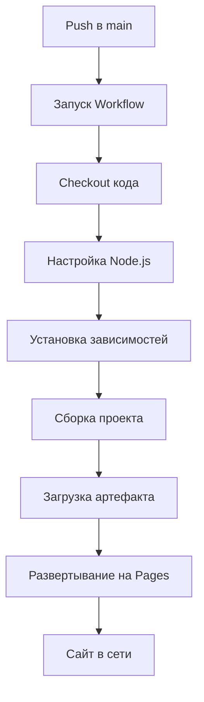
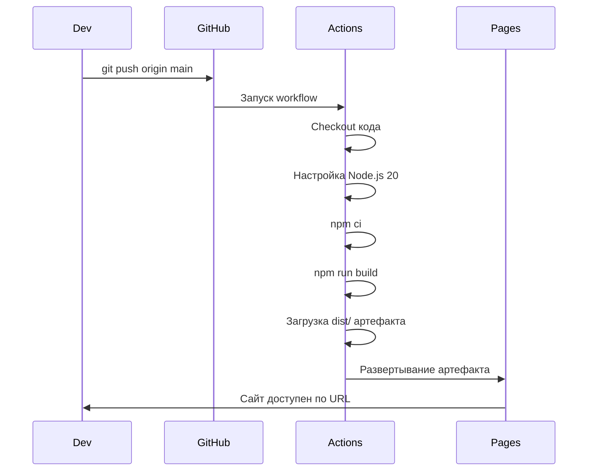

<div align="center">

# 🚢 Руководство по развертыванию

**Полное руководство по развертыванию StayFinder на GitHub Pages**

[← Домашняя страница документации](./README.md)

</div>

---

## 📋 Обзор

StayFinder настроен для **автоматического развертывания** на GitHub Pages с использованием GitHub Actions. Каждый push в ветку `main` запускает workflow сборки и развертывания.

### Архитектура развертывания


---

## ⚙️ Требования

Перед развертыванием убедитесь:

- ✅ Репозиторий на GitHub
- ✅ У вас есть доступ на push в репозиторий
- ✅ GitHub Pages включен (мы настроим это)

---

## 🚀 Быстрый старт развертывания

### Шаг 1: Push в GitHub

```bash
# Если еще не на GitHub
git remote add origin https://github.com/YOUR_USERNAME/stay-finder-delight.git
git push -u origin main
```

### Шаг 2: Включить GitHub Pages

1. Перейдите в ваш репозиторий на GitHub
2. Перейдите в **Settings** → **Pages**
3. В разделе **Source** выберите **GitHub Actions**
4. Сохраните настройки

### Шаг 3: Запустить развертывание

Workflow развертывания запускается автоматически при:

- ✅ Push в ветку `main`
- ✅ Ручном запуске через вкладку **Actions** → **Run workflow**

### Шаг 4: Дождаться развертывания

1. Перейдите во вкладку **Actions**
2. Следите за workflow "Deploy to GitHub Pages"
3. Дождитесь завершения (обычно 2-3 минуты)

### Шаг 5: Доступ к сайту

Ваш сайт будет доступен по адресу:

```
https://<USERNAME>.github.io/<REPO_NAME>/
```

Например:

```
https://AmaLS367.github.io/stay-finder-delight/
```

---

## 🔧 GitHub Actions Workflow

### Файл Workflow

Расположение: `.github/workflows/deploy-pages.yml`

### Структура Workflow



---

## ⚙️ Конфигурация

### Конфигурация Vite

Проект настроен для GitHub Pages с:

```typescript
// vite.config.ts
export default defineConfig({
  base: "./", // Важно для GitHub Pages
  // ...
});
```

**Почему `base: "./"`?**

- GitHub Pages обслуживает из `/<REPO_NAME>/`
- Относительные пути обеспечивают правильную загрузку ресурсов
- Работает с HashRouter

### HashRouter

StayFinder использует **HashRouter** вместо BrowserRouter:

```typescript
// src/App.tsx
import { HashRouter } from 'react-router-dom';

<HashRouter>
  <Routes>
    {/* Маршруты */}
  </Routes>
</HashRouter>
```

**Почему HashRouter?**

- Работает со статическим хостингом (GitHub Pages)
- Не требуется конфигурация сервера
- Избегает ошибок 404 при обновлении
- Глубокие ссылки работают автоматически

---

## 📦 Результат сборки

### Процесс сборки

```bash
npm run build
```

**Вывод:** Директория `dist/` содержащая:

- `index.html` - Главный HTML файл
- `assets/` - JavaScript, CSS, изображения
- `favicon.svg` - Иконка приложения
- `site.webmanifest` - PWA манифест

### Артефакты сборки

Workflow загружает всю директорию `dist/` на GitHub Pages.

---

## 🔍 Процесс развертывания

### Детальный поток



### Временная шкала

| Шаг            | Длительность | Описание                 |
| -------------- | ------------ | ------------------------ |
| Checkout       | ~10с         | Клонирование репозитория |
| Настройка Node | ~5с          | Установка Node.js        |
| Установка      | ~30-60с      | Установка зависимостей   |
| Сборка         | ~30-60с      | Сборка проекта           |
| Загрузка       | ~10с         | Загрузка артефакта       |
| Развертывание  | ~30с         | Развертывание на Pages   |
| **Итого**      | **~2-3 мин** | Полное развертывание     |

---

## 🐛 Решение проблем

### Сборка не удалась

**Проблема:** Шаг сборки не удался

**Решения:**

1. Проверьте логи Actions на ошибки
2. Проверьте зависимости в `package.json`
3. Убедитесь, что версия Node.js 20+
4. Проверьте ошибки TypeScript: `npm run build` локально

### Развертывание не удалось

**Проблема:** Шаг развертывания не удался

**Решения:**

1. Проверьте, что GitHub Pages включен
2. Проверьте права доступа к репозиторию
3. Убедитесь, что workflow имеет разрешение `pages: write`
4. Проверьте, не выполняется ли другое развертывание

### Ресурсы не загружаются

**Проблема:** Изображения/CSS/JS не загружаются

**Решения:**

1. Проверьте `base: "./"` в `vite.config.ts`
2. Проверьте, что пути к ресурсам относительные
3. Очистите кеш браузера
4. Проверьте консоль браузера на ошибки 404

### 404 при обновлении

**Проблема:** Получаете 404 при обновлении страниц

**Решения:**

1. Убедитесь, что используется HashRouter (не BrowserRouter)
2. Проверьте, что маршруты используют хэш (`/#/search` не `/search`)
3. Проверьте, что все маршруты определены

### Сайт не обновляется

**Проблема:** Изменения не появляются после развертывания

**Решения:**

1. Подождите несколько минут (кеш CDN)
2. Жесткое обновление браузера (Ctrl+Shift+R)
3. Проверьте вкладку Actions на успешное развертывание
4. Убедитесь, что вы запушили в ветку `main`

---

## 🔄 Ручное развертывание

### Запуск вручную

1. Перейдите во вкладку **Actions**
2. Выберите workflow **Deploy to GitHub Pages**
3. Нажмите **Run workflow**
4. Выберите ветку (обычно `main`)
5. Нажмите **Run workflow**

### Развертывание локально

```bash
# Собрать локально
npm run build

# Папка dist/ готова
# Но GitHub Actions обрабатывает развертывание автоматически
```

---

## 🌐 Пользовательский домен

### Настройка пользовательского домена

1. Перейдите в **Settings** → **Pages** репозитория
2. В разделе **Custom domain** введите ваш домен
3. Добавьте файл CNAME в репозиторий (GitHub может сделать это автоматически)
4. Настройте DNS записи:
   - **Тип:** CNAME
   - **Имя:** `@` или `www`
   - **Значение:** `<USERNAME>.github.io`

### Конфигурация DNS

```
Тип: CNAME
Имя: www
Значение: AmaLS367.github.io
```

---

## 📊 Статус развертывания

### Проверка статуса развертывания

1. **Вкладка Actions** - Просмотр запусков workflow
2. **Settings → Pages** - Просмотр истории развертываний
3. **URL сайта** - Посещение для проверки доступности

### История развертываний

GitHub Pages ведет историю развертываний:

- Каждое развертывание логируется
- Можно просмотреть предыдущие развертывания
- Можно откатить при необходимости

---

## 🔐 Разрешения

### Требуемые разрешения

Workflow требует:

```yaml
permissions:
  contents: read # Чтение репозитория
  pages: write # Развертывание на Pages
  id-token: write # OIDC аутентификация
```

### Настройки репозитория

Убедитесь:

- ✅ GitHub Pages включен
- ✅ Источник установлен на "GitHub Actions"
- ✅ Репозиторий публичный (или у вас есть GitHub Pro)

---

## 🎯 Лучшие практики

### 1. Тестирование перед развертыванием

```bash
# Сначала собрать локально
npm run build

# Превью сборки
npm run preview

# Тестирование локально
npm run dev
```

### 2. Использование семантического версионирования

Помечайте релизы для лучшего отслеживания:

```bash
git tag v1.0.0
git push origin v1.0.0
```

### 3. Мониторинг развертываний

- Регулярно проверяйте вкладку Actions
- Отслеживайте время развертывания
- Следите за ошибками сборки

### 4. Обновление зависимостей

```bash
npm outdated
npm update
```

### 5. Переменные окружения

При необходимости добавьте секреты в:
**Settings** → **Secrets and variables** → **Actions**

---

## 📝 Чеклист развертывания

Перед развертыванием:

- [ ] Код протестирован локально
- [ ] `npm run build` успешен
- [ ] Все зависимости закоммичены
- [ ] `package-lock.json` актуален
- [ ] GitHub Pages включен
- [ ] Файл workflow в `.github/workflows/`
- [ ] `base: "./"` установлен в `vite.config.ts`
- [ ] Используется HashRouter (не BrowserRouter)

---

## 🚀 После развертывания

### Проверка развертывания

1. Посетите URL вашего сайта
2. Протестируйте все маршруты:
   - Главная страница
   - Страница поиска
   - Детали объявления
   - Страница поездок
   - Страница избранного
3. Проверьте консоль браузера на ошибки
4. Протестируйте на мобильных устройствах

### Мониторинг производительности

- Проверьте время загрузки страниц
- Отслеживайте размеры бандлов
- Тестируйте на разных браузерах
- Проверьте функциональность PWA

---

## 🔄 Непрерывное развертывание

### Автоматическое развертывание

Workflow настроен для **непрерывного развертывания**:

- ✅ Каждый push в `main` запускает развертывание
- ✅ Не требуется ручных шагов
- ✅ Быстрая обратная связь

### Стратегия веток


---

## 📚 Дополнительные ресурсы

- [Документация GitHub Pages](https://docs.github.com/en/pages)
- [Документация GitHub Actions](https://docs.github.com/en/actions)
- [Руководство по развертыванию Vite](https://vitejs.dev/guide/static-deploy.html)

---

<div align="center">

**Развертывание завершено!** 🎉

[← Назад к документации](./README.md)

</div>
