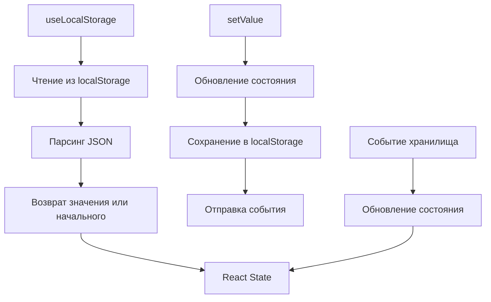
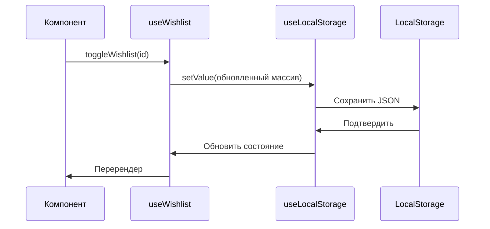
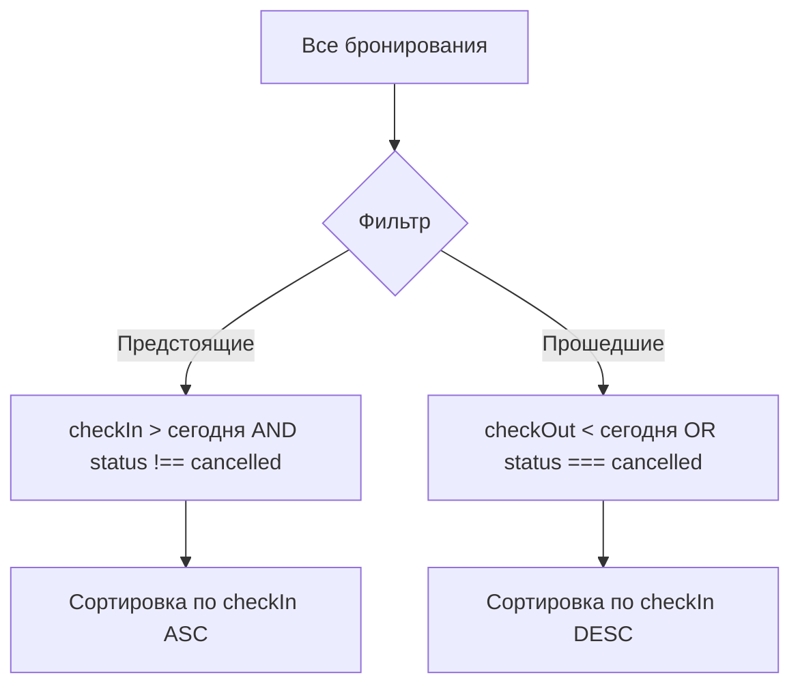
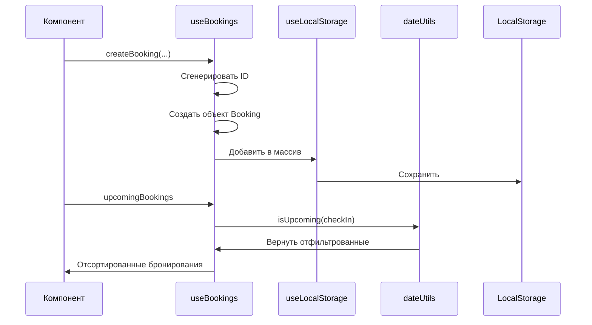
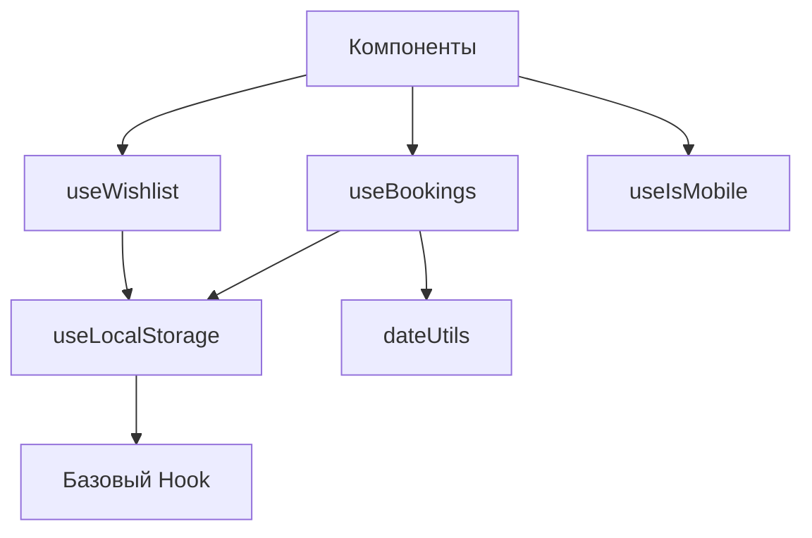
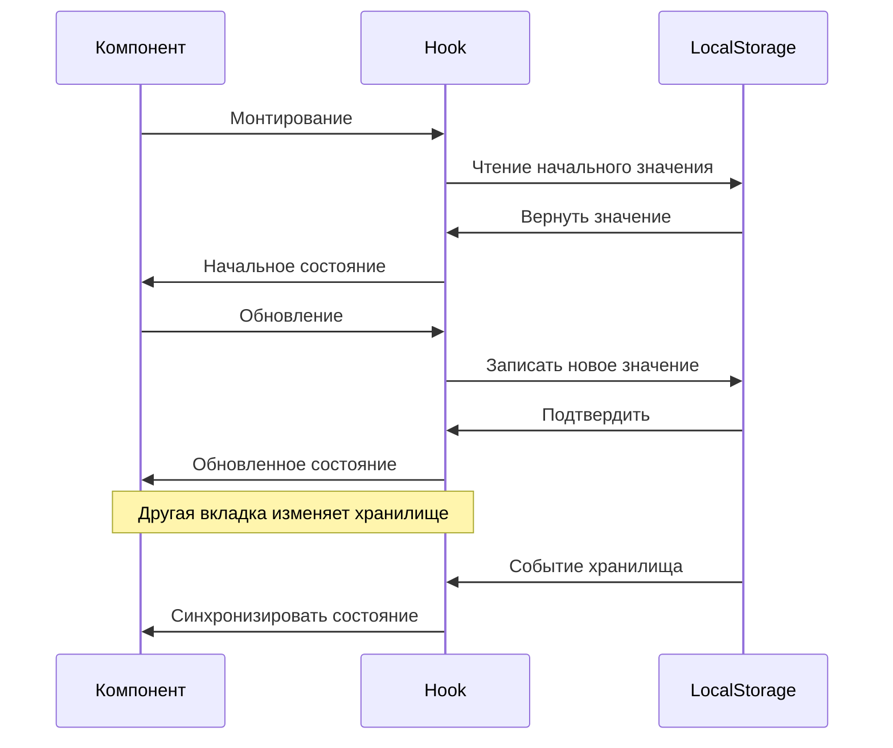

<div align="center">

# 🎣 Кастомные Hooks

**Полная API документация для кастомных React hooks StayFinder**

[← Домашняя страница документации](./README.md) • [API и данные →](./api-data.md)

</div>

---

## 📚 Обзор Hooks

StayFinder предоставляет кастомные React hooks для управления состоянием приложения и бизнес-логикой. Все hooks следуют лучшим практикам React и предоставляют типобезопасные API.

### Доступные Hooks

| Hook | Назначение | Расположение |
|------|---------|----------|
| **useLocalStorage** | Обертка постоянного хранилища | `src/hooks/useLocalStorage.ts` |
| **useWishlist** | Управление избранным | `src/hooks/useWishlist.ts` |
| **useBookings** | Управление бронированиями | `src/hooks/useBookings.ts` |
| **useIsMobile** | Определение мобильного устройства | `src/hooks/use-mobile.tsx` |

---

## 💾 useLocalStorage

Базовый hook для постоянного хранения в localStorage с синхронизацией состояния React.

### API

```typescript
function useLocalStorage<T>(
  key: string,
  initialValue: T
): [T, (value: T | ((prev: T) => T)) => void]
```

### Параметры

| Параметр | Тип | Описание |
|-----------|------|-------------|
| `key` | `string` | Ключ localStorage |
| `initialValue` | `T` | Значение по умолчанию, если ключ не существует |

### Возвращает

- `[0]` - Текущее сохраненное значение
- `[1]` - Функция установки (поддерживает функциональные обновления)

### Возможности

- ✅ **Типобезопасность** - Полная поддержка TypeScript
- ✅ **SSR-безопасность** - Обрабатывает серверный рендеринг
- ✅ **Синхронизация между вкладками** - Слушает события хранилища
- ✅ **Обработка ошибок** - Graceful fallback при ошибках

### Использование

```typescript
import { useLocalStorage } from '@/hooks/useLocalStorage';

function MyComponent() {
  const [value, setValue] = useLocalStorage('my-key', 'default');
  
  // Обновить значение
  setValue('новое значение');
  
  // Функциональное обновление
  setValue(prev => prev + ' обновлено');
  
  return <div>{value}</div>;
}
```

### Детали реализации



### Обработка событий хранилища

Hook слушает:
- **`storage` событие** - Изменения из других вкладок
- **`local-storage` событие** - Изменения из той же вкладки

---

## ❤️ useWishlist

Управляет избранным пользователя (сохраненные объявления) с постоянным хранением в localStorage.

### API

```typescript
function useWishlist(): {
  wishlist: string[];
  addToWishlist: (listingId: string) => void;
  removeFromWishlist: (listingId: string) => void;
  toggleWishlist: (listingId: string) => void;
  isInWishlist: (listingId: string) => boolean;
  clearWishlist: () => void;
}
```

### Возвращает

| Свойство | Тип | Описание |
|---------|------|-------------|
| `wishlist` | `string[]` | Массив ID объявлений |
| `addToWishlist` | `(id: string) => void` | Добавить объявление в избранное |
| `removeFromWishlist` | `(id: string) => void` | Удалить объявление из избранного |
| `toggleWishlist` | `(id: string) => void` | Переключить объявление в избранном |
| `isInWishlist` | `(id: string) => boolean` | Проверить, есть ли объявление в избранном |
| `clearWishlist` | `() => void` | Очистить все избранное |

### Использование

```typescript
import { useWishlist } from '@/hooks/useWishlist';

function ListingCard({ listing }) {
  const { isInWishlist, toggleWishlist } = useWishlist();
  const isSaved = isInWishlist(listing.id);
  
  return (
    <button onClick={() => toggleWishlist(listing.id)}>
      {isSaved ? 'Удалить из избранного' : 'Добавить в избранное'}
    </button>
  );
}
```

### Поток данных



### Ключ хранилища

Использует константу `STORAGE_KEYS.WISHLIST`: `'stayfinder_wishlist'`

### Пример: Полное управление избранным

```typescript
function WishlistPage() {
  const { wishlist, clearWishlist } = useWishlist();
  
  return (
    <div>
      <h1>Мое избранное ({wishlist.length})</h1>
      {wishlist.length > 0 && (
        <button onClick={clearWishlist}>Очистить все</button>
      )}
    </div>
  );
}
```

---

## 📅 useBookings

Управляет бронированиями пользователя (поездки) с фильтрацией и управлением статусом.

### API

```typescript
function useBookings(): {
  bookings: Booking[];
  upcomingBookings: Booking[];
  pastBookings: Booking[];
  createBooking: (
    listing: Listing,
    checkIn: string,
    checkOut: string,
    guests: number,
    totalPrice: number
  ) => Booking;
  cancelBooking: (bookingId: string) => void;
  getBookingById: (id: string) => Booking | undefined;
}
```

### Возвращает

| Свойство | Тип | Описание |
|---------|------|-------------|
| `bookings` | `Booking[]` | Все бронирования |
| `upcomingBookings` | `Booking[]` | Предстоящие бронирования (отсортированные) |
| `pastBookings` | `Booking[]` | Прошедшие/отмененные бронирования (отсортированные) |
| `createBooking` | `(...) => Booking` | Создать новое бронирование |
| `cancelBooking` | `(id: string) => void` | Отменить бронирование |
| `getBookingById` | `(id: string) => Booking?` | Получить бронирование по ID |

### Использование

```typescript
import { useBookings } from '@/hooks/useBookings';

function ListingPage({ listing }) {
  const { createBooking } = useBookings();
  const [checkIn, setCheckIn] = useState('');
  const [checkOut, setCheckOut] = useState('');
  const [guests, setGuests] = useState(2);
  
  const handleBook = () => {
    const totalPrice = calculateTotal(listing, checkIn, checkOut);
    const booking = createBooking(
      listing,
      checkIn,
      checkOut,
      guests,
      totalPrice
    );
    // Бронирование создано и сохранено
  };
  
  return <button onClick={handleBook}>Забронировать</button>;
}
```

### Статус бронирования

Бронирования могут иметь три статуса:

- `'confirmed'` - Активное бронирование
- `'cancelled'` - Отмененное бронирование
- `'completed'` - Прошедшее бронирование

### Логика фильтрации



### Поток данных



### Генерация ID бронирования

```typescript
const bookingId = `booking_${Date.now()}_${Math.random().toString(36).substr(2, 9)}`;
```

### Пример: Страница поездок

```typescript
function TripsPage() {
  const { upcomingBookings, pastBookings, cancelBooking } = useBookings();
  
  return (
    <div>
      <h1>Предстоящие поездки</h1>
      {upcomingBookings.map(booking => (
        <TripCard 
          key={booking.id} 
          booking={booking}
          onCancel={() => cancelBooking(booking.id)}
        />
      ))}
      
      <h1>Прошедшие поездки</h1>
      {pastBookings.map(booking => (
        <TripCard key={booking.id} booking={booking} />
      ))}
    </div>
  );
}
```

---

## 📱 useIsMobile

Определяет, находится ли пользователь на мобильном устройстве.

### API

```typescript
function useIsMobile(): boolean
```

### Возвращает

- `boolean` - `true` если мобильное устройство, `false` иначе

### Использование

```typescript
import { useIsMobile } from '@/hooks/use-mobile';

function ResponsiveComponent() {
  const isMobile = useIsMobile();
  
  return (
    <div className={isMobile ? 'mobile-layout' : 'desktop-layout'}>
      Контент
    </div>
  );
}
```

### Реализация

Использует breakpoint ширины окна (768px) с API `matchMedia` для определения мобильных устройств. Возвращает `true`, если ширина окна меньше 768px.

---

## 🔗 Зависимости Hooks



---

## 🎯 Лучшие практики

### 1. Используйте Hooks на верхнем уровне компонента

```typescript
// ✅ Хорошо
function Component() {
  const { wishlist } = useWishlist();
  // ...
}

// ❌ Плохо
function Component() {
  if (condition) {
    const { wishlist } = useWishlist(); // Не делайте так
  }
}
```

### 2. Мemoизируйте дорогие операции

```typescript
const filteredBookings = useMemo(
  () => bookings.filter(b => b.status === 'confirmed'),
  [bookings]
);
```

### 3. Используйте функциональные обновления

```typescript
// ✅ Хорошо - для сложных обновлений
setWishlist(prev => {
  if (prev.includes(id)) return prev;
  return [...prev, id];
});

// ✅ Тоже хорошо - для простых обновлений
setWishlist([...wishlist, id]);
```

### 4. Обрабатывайте состояния загрузки

```typescript
const [wishlist, setWishlist] = useLocalStorage('wishlist', []);
const isLoading = wishlist === null; // Обработать начальную загрузку
```

---

## 🧪 Тестирование Hooks

### Пример структуры теста

```typescript
import { renderHook, act } from '@testing-library/react';
import { useWishlist } from '@/hooks/useWishlist';

test('добавляет объявление в избранное', () => {
  const { result } = renderHook(() => useWishlist());
  
  act(() => {
    result.current.addToWishlist('listing-1');
  });
  
  expect(result.current.isInWishlist('listing-1')).toBe(true);
});
```

---

## 🔄 Жизненный цикл Hook



---

## 📊 Схема хранилища

### Хранилище избранного

```json
{
  "stayfinder_wishlist": ["listing-1", "listing-2", "listing-3"]
}
```

### Хранилище бронирований

```json
{
  "stayfinder_bookings": [
    {
      "id": "booking_1234567890_abc123",
      "listingId": "listing-1",
      "listing": { /* полный объект объявления */ },
      "checkIn": "2024-01-15",
      "checkOut": "2024-01-20",
      "guests": 2,
      "totalPrice": 500,
      "status": "confirmed",
      "createdAt": "2024-01-01T00:00:00.000Z"
    }
  ]
}
```

---

<div align="center">

**Следующее:** Изучите [API и структуры данных](./api-data.md) →

</div>

